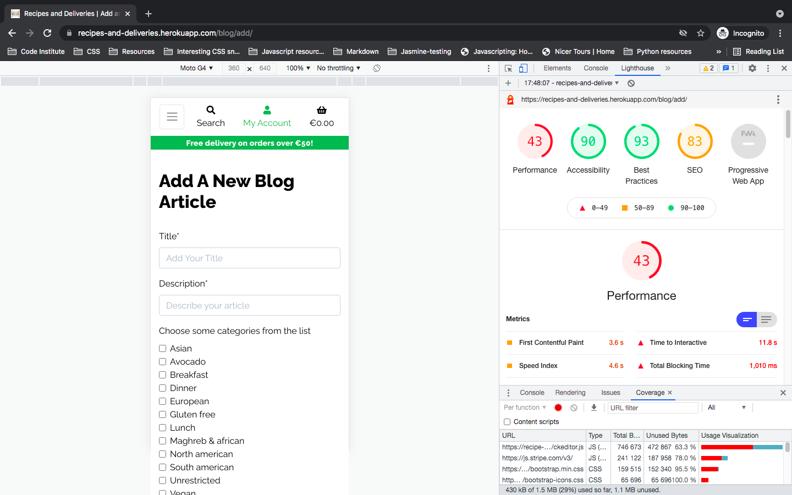
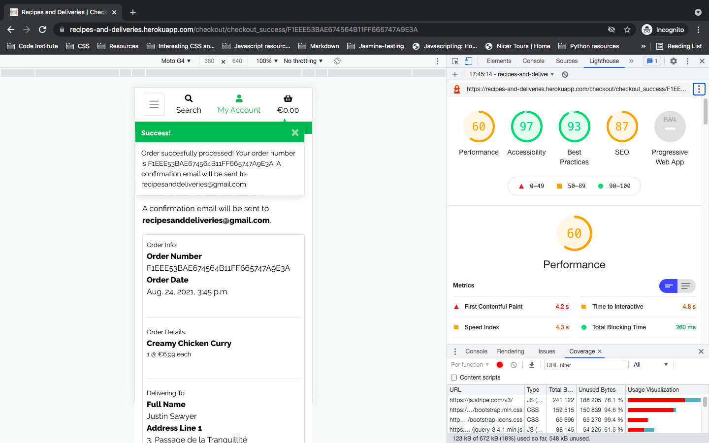
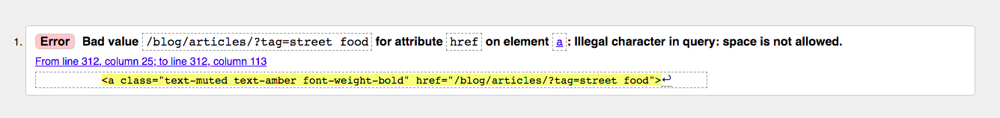
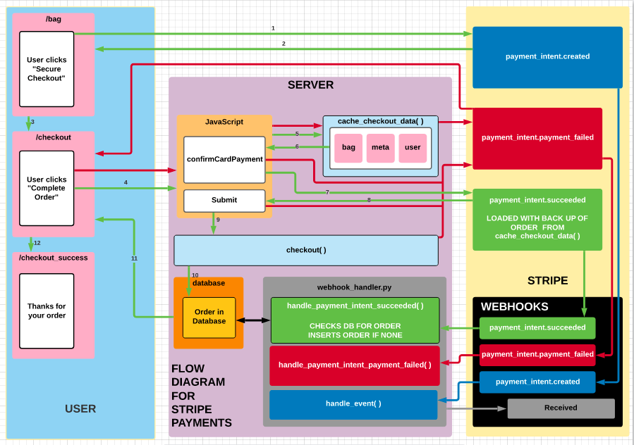

<h1 align="center"><a style="color:green" href="">Recipes and Deliveries</a></h1>


- [User Experience (UX)](#user-experience-ux-)
  * [User stories](#user-stories)
    + [First Time Visitors](#first-time-visitors)
    + [Returning Registered Visitors](#returning-registered-visitors)
    + [Returning "Anonymous" Visitors](#returning-anonymous-visitors)
    + [Frequent Registered Visitors](#frequent-registered-visitors)
    + [Frequent Anonymous Visitors](#frequent-anonymous-visitors)
  * [Professionals and Aspiring Chefs](#professionals-and-aspiring-chefs)
  * [Design](#design)
    + [Overall Colour Scheme](#overall-colour-scheme)
    + [Typography](#typography)
    + [Imagery](#imagery)
      - [Recipe Box Photos](#recipe-box-photos)
      - [Backgrounds](#backgrounds)
      - [Recipe Box Cards](#recipe-box-cards)
  * [Wireframes](#wireframes)
  * [Features](#features)
  * [Technologies Used](#technologies-used)
    + [Languages](#languages)
    + [Frameworks, Libraries & Programs](#frameworks-libraries-programs)
- [Testing](#testing)
  * [Code Validation](#code-validation)
  * [Testing User Stories](#testing-user-stories)
    + [First Time Visitors](#first-time-visitors-1)
    + [Returning Registered Visitors](#returning-registered-visitors-1)
    + [Returning "Anonymous" Visitors](#returning-anonymous-visitors-1)
    + [Frequent Registered Visitors](#frequent-registered-visitors-1)
    + [Frequent Anonymous Visitors](#frequent-anonymous-visitors-1)
  * [Professionals and Aspiring Chefs](#professionals-and-aspiring-chefs-1)
  * [Testing Functionality](#testing-functionality)
  * [Star Ratings](#star-ratings)
  * [Changing photos on user added content](#changing-photos-on-user-added-content)
  * [Search](#search)
  * [Tags and Categories](#tags-and-categories)
    + [Part 1](#part-1)
  * [Tags and Categories](#tags-and-categories-1)
    + [Part 2](#part-2)
  * [Formset and Inlines](#formset-and-inlines)
    + [Formset](#formset)
    + [Inlines](#inlines)
  * [Discount](#discount)
    + [Votes added to recipe](#votes-added-to-recipe)
    + [How discount is applied: when the checkout form validates](#how-discount-is-applied-when-the-checkout-form-validates)
    + [Stripe](#stripe)
  * [Known Bugs](#known-bugs)
- [Back End](#back-end)
  * [RECIPE BOXES Database Models](#recipe-boxes-database-models)
    + [Category](#category)
    + [Product](#product)
  * [USER Database Models](#user-database-models)
  * [BLOG Database Models](#blog-database-models)
    + [Category](#category-1)
    + [Tag](#tag)
    + [Posts](#posts)
  * [RECIPE Database Models](#recipe-database-models)
    + [Category](#category-2)
    + [Tag](#tag-1)
    + [Recipe](#recipe)
    + [Ingredients](#ingredients)
  * [ORDER Database Models](#order-database-models)
  * [Notes on models](#notes-on-models)
    + [Category, Tag and their associate models](#category-tag-and-their-associate-models)
    + [Order: null & blank values](#order-null-blank-values)
    + [ckeditor in Recipe, Product and Blog models](#ckeditor-in-recipe-product-and-blog-models)
    + [Product & Recipe relationship](#product-recipe-relationship)
  * [Data Structures (JSON)](#data-structures-json-)
    + [PRODUCT](#product)
      - [Categories](#categories)
      - [Products](#products)
    + [BLOG](#blog)
      - [Categories](#categories-1)
      - [Tags](#tags)
      - [Post](#post)
    + [RECIPE](#recipe)
      - [Categories](#categories-2)
      - [Tags](#tags-1)
      - [Recipe](#recipe-1)
      - [Ingredient](#ingredient)
    + [Note about Postgres Database and Commit](#note-about-postgres-database-and-commit)
- [Deployment](#deployment)
  * [Deploying to Heroku](#deploying-to-heroku)
    + [Create the app at heroku.com](#create-the-app-at-herokucom)
    + [Enable the postgres database in app/settings.py](#enable-the-postgres-database-in-app-settingspy)
    + [Migrating data](#migrating-data)
    + [Using the environment for the DATABASES dictionary](#using-the-environment-for-the-databases-dictionary)
    + [Create a web dyno to run gunicorn and serve the app](#create-a-web-dyno-to-run-gunicorn-and-serve-the-app)
    + [Log in to heroku through the CLI and disable static file collection](#log-in-to-heroku-through-the-cli-and-disable-static-file-collection)
    + [Allow heroku and GitHub (for development) to host the live site](#allow-heroku-and-github-for-development-to-host-the-live-site)
    + [Set up automatic deployment](#set-up-automatic-deployment)
    + [Set SECRET_KEY variables in heroku and GitPod](#set-secret-key-variables-in-heroku-and-gitpod)
    + [Debug settings](#debug-settings)
    + [Commit](#commit)
  * [Storing static files and images](#storing-static-files-and-images)
    + [Create a bucket in Amazon AWS](#create-a-bucket-in-amazon-aws)
    + [Bucket Properties](#bucket-properties)
    + [Bucket Permissions](#bucket-permissions)
  * [Identity and Access Management](#identity-and-access-management)
    + [Creating AWS Groups, Policies and Users in order to access the images and static files](#creating-aws-groups-policies-and-users-in-order-to-access-the-images-and-static-files)
    + [Creating the User Group](#creating-the-user-group)
    + [Creating the Policy](#creating-the-policy)
    + [Attaching the Policy to the User Group](#attaching-the-policy-to-the-user-group)
    + [Creating the User for the User Group](#creating-the-user-for-the-user-group)
  * [Configure Django to connect to S3](#configure-django-to-connect-to-s3)
    + [Add settings to settings.py so that the live (deployed to heroku) site connects to S3.](#add-settings-to-settingspy-so-that-the-live-deployed-to-heroku-site-connects-to-s3)
    + [Adding the AWS keys to heroku's Config Vars](#adding-the-aws-keys-to-heroku-s-config-vars)
    + [Tell django where static files will come from in production](#tell-django-where-static-files-will-come-from-in-production)
  * [Caching, Media Files & Admin](#caching-media-files-admin)
    + [Caching](#caching)
    + [Adding Media Files to S3](#adding-media-files-to-s3)
    + [Confirm admin status](#confirm-admin-status)
  * [Stripe](#stripe-1)
    + [Stripe keys](#stripe-keys)
    + [Webhooks](#webhooks)
  * [Testing](#testing-1)
  * [Emails](#emails)
    + [The email account](#the-email-account)
    + [The live site](#the-live-site)
  * [Clone this GitHub Repository](#clone-this-github-repository)
- [Future Plans](#future-plans)
  * [ckeditor](#ckeditor)
  * [The "add recipe" process](#the-add-recipe-process)
  * [Recipe Box / Recipe relationship](#recipe-box-recipe-relationship)
  * [Vote count](#vote-count)
  * [Tags](#tags-2)
  * [Null and blank](#null-and-blank)
  * [Automated testing](#automated-testing)
- [Credits](#credits)
  * [Code](#code)
  * [Media](#media)
  * [Plagiarism](#plagiarism)
  * [Content](#content)
  * [Acknowledgements](#acknowledgements)

<small><i><a href='http://ecotrust-canada.github.io/markdown-toc/'>Table of contents generated with markdown-toc</a></i></small>


This is the website and application for **Recipes***and***Deliveries**, a community driven website and app offering the ability to purchase meal kits, contribute to the repository of recipes available for purchasing as well as to its blog.

While the website is free to use and peruse, certain parts of the site are reserved for account holders. These include:

1. Creating and editing recipes and blog posts
2. Ingredient listings and recipe preparation in user created posts
3. The ability to up-vote (or like) user created recipes

Although community based, the purpose of the website is commercial, thus readers are urged to sign up and order meal kits in order to access all parts of the website.

As an encouragement for users to do so, the user has the possibility of having his or her submitted recipes being added to the database of recipes and earning a discount once their recipe is added as a Recipe Box.

# User Experience (UX)
## User stories
### First Time Visitors

1) As a first time visitor, I want at first glance to understand the principle of the site:

	- I want to know that the recipes listed as products are meal kits and that all ingredients are included when I order a kit. Upon receipt of the kit, all I then need to do is follow the cooking instructions.

	- I want to understand about the delivery service and especially about how cold chain and hygiene rules are respected.

	- I want to be made aware about the benefits of using the service, such as the reduction of food waste and any economies I might make through the use of the service.

	- I want to be reassured that wherever possible, local ingredients and suppliers are used, and that all fresh ingredients are traceable.

	- I want the possibility to sign up to the service to access all the features of the website, whether I decide to purchase a recipe kit or not.

2) Upon ordering a recipe kit, I either:

	- Want the possibility of being an "anonymous" user. That is, should I so wish, I want to be able to order a recipe kit without having to create an account.

	- Want to become a registered user, with my details saved for both making future purchases and for contributing to the growing list of community recipes and blog posts.

### Returning Registered Visitors

1) As a returniing registered visitor, I would like to alert the community of the quality of the recipe box(es) I ordered:

	- I would like to be able to leave comments on the recipe details page.

2) As a registered user, I would like the possibility to:

	- Comment on blog posts created by other community members.

	- Up-vote community-created recipes that I find particluarly mouth-watering in the hope that these recipes will be added to the recipe database.

	- Create and edit my own recipe concoctions and have them voted on by other community members.

	- Delete blog posts and recipes should I need to.

3) Upon making further orders, I wish that the following information be retrieved automatically, so that I do not have to go through the tedium of re-enetering the details:

	- Delivery address

	- Invoice address

	- Email & telephone details

4) I wish to be able to edit the above details both when I make a purchase and from within my Account page

### Returning "Anonymous" Visitors

1) As a returning anonymous user, I understand that remaining anonymous means just that. However:

	- If I have previously made a purchase, my invoice address and delivery address has been retained for the purpose of invoicing and delivery. I understand that this information is stored by necessity only.

	- Upon returning to the app, I understand that I will be prompted to create an account in order to access all the features of the website, and contribute to the community should I decide to.

### Frequent Registered Visitors

1) As a frequent registered visitor, I will be a participating member of the **Recipes***and***Deliveries** community:

	- I will have made regular orders of Recipe Boxes, and am likely to have created either recipes or blog entries.

	- If I have created recipes and my recipes have been voted as being the most popular of the last month, I will be alerted that this is the case, and I will see my recipe featured on the recipe boxes purchasing page.

2) As a frequent registered visitor whose recipes have received a certain number of votes and thus qualify to be added as Recipe Boxes:

	- I understand that I, myself, have nothing to do except collect the reward (see next point). I understand that **Recipes***and***Deliveries** look after the dispatching of recipe boxes, and that all I have done is create the recipe itself.

	- I understand that when the recipe I created is added as a Recipe Box, I will be given a credit that is redeemable against a future order I make on the **Recipes***and***Deliveries** website.

	- I can see a tally of the total votes for my recipe on my User Account page. When any recipes I create reach the required number of votes, I will be alerted by email of this fact, and thus will know I have a discount to claim.

### Frequent Anonymous Visitors

1) I have a good understanding of the functionality of the site, but have chosen for whatever reason to remain anonymous:

	- I accept that doing so means that some part of the site will remain inacessible to me until I decide to register.

	- If I do decide to register, I will get full access to the site, but am not obligated to contribute.

## Professionals and Aspiring Chefs

**Recipes***and***Deliveries** has the possibility of centralising the multitute of recipe websites that can be found online.

Just as regular users can earn a credit when other users vote for one of their recipes, **Recipes***and***Deliveries** could be a place that hghlights up and coming talents. Once a professional, accredited chef signs on to the service, **Recipes***and***Deliveries** could be a place where said chef might make an income. For the professional, in other words, there could be a small monetary reward instead of a credit whenever a user orders a professional's recipes. 

## Design
### Overall Colour Scheme
		
The project uses a simple design, with colours that are designed to make the end user either think of food or that are intuitive in what their purpose is. 

Thus, green is the natural choice for its primary colour. Green is the colour of both most vegetables and most herbs, and is universally known as "Go". Thus the user knows that generally speaking, clicking something green will take the user there. Equally, if the user is registered and wants to contribute to the community, this green signifies "create".

The green is contrasted with brown, which makes the end user think of the warmth of spice and spice mixtures. The brown chosen - the colour of cinnamon - is almost amber, which makes the user think of preparing, just as the amber light in traffic signals tells the driver to prepare to go. Thus, where this cinnamon colour is used, the user knows to either prepare to edit a recipe or the user's Account details.

Where red is used, the user knows this as a "stop", just as the red in traffic signals does. Thus, when red is used in the "store", it means "cancel". Equally, on the community side of the site, red can stand for either deleting something, or anything with a "negative" connotation to it, such as removing a recipe from the user's list of favourite recipes. The exception for this is of course where the recipes are in the list of favourites - the natural colour for a badge containing a heart is of course red.

### Typography
		
Taste is of course a very evocative sense. For this reason, the typography of this website is very important. Just as it is almost always possible to tell the quality of a restaurant from looking at the styling of its menu, this is also the case for the **Recipes***and***Deliveries** website.

It is for this reason that the [Great Vibes](https://fonts.google.com/specimen/Great+Vibes) font has been chosen for headlines and slogans. The font is at once clean and flowing while also being elegant - just as a visit to a classy restaurant should be.

Otherwise, for general text and banners, [Raleway](https://fonts.google.com/specimen/Raleway?query=raleway) has been chosen. A simple sans-serif, it has been chosen for both its clarity and for the nuance behind its name: Raleway resembles the font styles used in transport hubs such as railway stations. Going to the station implies taking a journey, and people often talk of going on a "culinary adventure" - a journey in its own right. Raleway, then, is the perfect base font for **Recipes***and***Deliveries**.

### Imagery
#### Recipe Box Photos
		
Imagery is extremely important on any website, but especially so on commercial, food orientated ones: Nothing makes the tongue water more than seeing a beautifully presented meal. The images inspire the end user to both try the recipe, and more importantly, join the community and become an active member.

The "all recipe boxes" page is a showcase for all the recipe boxes that are available for order, and each is represented by an image and star rating (see Testing, below).

Ideally, each individual recipe box page should have the final end meal for that recipe as its banner image. However, this is a community website, where users are encouraged to participate by adding their own recipes to that section of the site and eventually to the repository. 

Thus, when uploading a recipe to the website, the community member is prompted to add an image of the prepared meal. 

For plaigirism reasons, the user is only given the option of uploading images from their device, rather than having the option to search online for images. The user is also asked to provide an image credit.

However, it is fair to say that not everyone knows how to take a good photo, just as not everyone knows how to cook. 

It is for this reason that images on the Recipe Box pages might have been either professionally sourced, or created by the site owners themselves. It is for this reason that images are credited.

#### Backgrounds

Again, to reinforce the desire for food - and thus purchasing a recipe box -  an image of fresh produce has been used as the background rather than a plain white one. Care has been taken to ensure that banner or headline text is not rendered illegible by the background image. All "generic" screen sizes have been tested (ie, xs (mobile), sm (tablet portrait), md (tablet landscape, lg (desktop) and xl) but there may be certain "in-between" screen resolutions where this text may be obscured by the background image.

#### Recipe Box Cards

Recipe boxes are presented as cards with white backgrounds. Thus each recipe box available for order is subtly highlighted against the screen background. White has been chosen to once again reinforce the idea of "fresh, clean and hygienic".

## Wireframes

[Landing Page, highlighting the commercial service](https://github.com/Justin-Sawyer/recipes_and_deliveries/blob/master/documentation/wireframes/1-recipes.png)

[Landing Page, highlighting the community aspect](https://github.com/Justin-Sawyer/recipes_and_deliveries/blob/master/documentation/wireframes/2-deliveries.png)

[Commerce, all Recipe Boxes](https://github.com/Justin-Sawyer/recipes_and_deliveries/blob/master/documentation/wireframes/3-all-recipe-boxes.png)

[Commerce, individual Recipe Box](https://github.com/Justin-Sawyer/recipes_and_deliveries/blob/master/documentation/wireframes/4-recipe-box.png)

[Commerce, shopping bag](https://github.com/Justin-Sawyer/recipes_and_deliveries/blob/master/documentation/wireframes/5-bag.png)

[Commerce, checkout](https://github.com/Justin-Sawyer/recipes_and_deliveries/blob/master/documentation/wireframes/6-checkout.png)

[Community, blog](https://github.com/Justin-Sawyer/recipes_and_deliveries/blob/master/documentation/wireframes/7-community-blog.png)

[Community, individual blog entry](https://github.com/Justin-Sawyer/recipes_and_deliveries/blob/master/documentation/wireframes/8-community-blog-entry.png)

[Community, add edit or delete blog post](https://github.com/Justin-Sawyer/recipes_and_deliveries/blob/master/documentation/wireframes/9-community-blog-add-edit-delete-post.png)

[Community, recipes](https://github.com/Justin-Sawyer/recipes_and_deliveries/blob/master/documentation/wireframes/10-community-recipes.png)

[Community, individual recipe entry](https://github.com/Justin-Sawyer/recipes_and_deliveries/blob/master/documentation/wireframes/11-community-recipe-entry.png)

[Community, add edit or delete recipe post](https://github.com/Justin-Sawyer/recipes_and_deliveries/blob/master/documentation/wireframes/12-community-recipes-add-edit-delete-recipe.png)

## Features

This website is fully responsive and interactive.

## Technologies Used
### Languages
	
[HTML5](https://en.wikipedia.org/wiki/HTML5)

[CSS](https://en.wikipedia.org/wiki/CSS)

[JavaScript](https://en.wikipedia.org/wiki/JavaScript)

[jQuery](https://en.wikipedia.org/wiki/JQuery)

[JSON](https://en.wikipedia.org/wiki/JSON)

[Python](https://en.wikipedia.org/wiki/Python_(programming_language))

### Frameworks, Libraries & Programs

[Markdown Editor](https://iwaki.info/markdown-editor-mac/en/index.html) was used for the writing of this README.md file.

[Balsamiq](https://balsamiq.com) was used for the creation of the wireframes.

[Git](https://git-scm.com) was used for version control.

[GitPod](https://www.gitpod.io/) was used as the writing tool. 

[GitHub](https://www.gitpod.io/) was used as the repository for the files within this project.

[Heroku](https://www.heroku.com/home) was used for hosting this project.

[Amazon Web Services](https://aws.amazon.com/) was used for the hosting of static files.

[Preview for Mac](https://support.apple.com/en-gb/guide/preview/welcome/mac) was used for image sizing (height and width), where images are the author's own or were posted by the author.

[Squash](https://www.realmacsoftware.com/squash/) was used to lighten the weight of image files, where images are the author's own or were posted by the author.

[Bootstrap](https://getbootstrap.com/) forms the vast majority of the formatting code, such as the grid system, containers, buttons, icons etc. It has been heavily modified by the author of this project to suit the website's needs.

[Font Awesome v4.7.0](https://fontawesome.com/v4.7.0/) was used for the social icons used on this site, since they are so easily recognisable.

[Google Fonts](https://fonts.google.com/) was used for the typography.

[Django](https://www.djangoproject.com/) is the framework upon which this website is built.

[Django-allauth](https://django-allauth.readthedocs.io/en/latest/index.html) was used for user authentication.

[Stripe](https://stripe.com/en-gb) was used for the payment system.

[Pexels](https://www.pexels.com/) was used to source the Recipe Box card images, unless otherwise stated.

# Testing
## Code Validation

This website was tested using the following tools:

1. [W3C HTML](https://validator.w3.org/) was used to verify the HTML code:
	* [Results](https://github.com/Justin-Sawyer/recipes_and_deliveries/tree/master/documentation/screenshots/html)

2. [W3C CSS](https://jigsaw.w3.org/css-validator/) was used to ensure there were no CSS code errors in this project:
	* [Results](https://github.com/Justin-Sawyer/recipes_and_deliveries/tree/master/documentation/screenshots/css)

3. [JSHint](https://jshint.com/) was used for the verification of the JavaScript:
	* [Results](https://github.com/Justin-Sawyer/recipes_and_deliveries/tree/master/documentation/screenshots/js)

4. [Python Validator](http://pep8online.com/) was used for verification of all Python code:
	* [Results (.txt files)](https://github.com/Justin-Sawyer/recipes_and_deliveries/tree/master/documentation/screenshots/python)

5. Google Chrome's Dev Tool was used extensively while writing this website.

6. The [Lighthouse plugin for Google Chrome](https://chrome.google.com/webstore/detail/lighthouse/blipmdconlkpinefehnmjammfjpmpbjk?hl) was used for speed checking and "tweaking" settings for maximal optimisation for web deployment.
	* [Results (.pdf files)](https://github.com/Justin-Sawyer/recipes_and_deliveries/tree/master/documentation/screenshots/lighthouse)

    Note about Lighthouse results:

	There are certain results that yield very poor Lighthouse results. The developer has looked into the reasons for these bad results, and is convinced that they are not a result of any code he has written. Instead, some of these bad results come from an outside dependency: ckeditor. This is the Rich Text Editor found on `/add` and `/edit` pages. Included below is an example screenshot showing this:

	

	A further poor results can be seen on the checkout success page. Again, this result is caused by external factors, namely Stripe's js:

	

    While these results might just be simple anomalies, the developer has added researching ckeditor to his list of future plans. See future plans, below.

## Testing User Stories
### First Time Visitors

1) As a first time visitor, I want at first glance to understand the principle of the site:

	- I want to know that the recipes listed as products are meal kits and that all ingredients are included when I order a kit. Upon receipt of the kit, all I then need to do is follow the cooking instructions.

		- This is clearly noted on each Recipe Box page.

	- I want to understand about the delivery service and especially about how cold chain and hygiene rules are respected.

		- There is a dedicated "guarantee" page that deals with this.

	- I want to be made aware about the benefits of using the service, such as the reduction of food waste and any economies I might make through the use of the service.

		- There is a dedicated "guarantee" page that deals with this.

	- I want to be reassured that wherever possible, local ingredients and suppliers are used, and that all fresh ingredients are traceable.

		- There is a dedicated "guarantee" page that deals with this.

	- I want the possibility to sign up to the service to access all the features of the website, whether I decide to purchase a Recipe Box or not.

		- The user can decide to join the community while placing an order, or can choose to register through the navigation of the site.

2) Upon ordering a Recipe Box, I either:

	- Want the possibility of being an "anonymous" user. That is, should I so wish, I want to be able to order a Recipe Box without having to create an account.

		- Anonymous checkout is allowed, and the anonymous user of course receives confirmation of the order through their email.

	- Want to become a registered user, with my details saved for both making future purchases and for contributing to the growing list of community recipes and blog posts.

		- The user's details are saved automatically should they wish to join the community. Further, where the user can create or edit blog posts or articles, or comment, the user's username is automatically added.

### Returning Registered Visitors

1) As a returniing registered visitor, I would like to alert the community of the quality of the recipe box(es) I ordered:

	- I would like to be able to leave comments on the recipe details page.

		- Comments are possible on Recipe Box pages to review the product.

2) As a registered user, I would like the possibility to:

	- Comment on blog posts created by other community members.

		- Comments are possible on user (or admin) created blog articles.

	- Up-vote community-created recipes that I find particluarly mouth-watering in the hope that these recipes will be added to the recipe database.

		- The user can vote on recipes published by other users. If the user then decides to change their mind, they can and their vote is removed.

	- Create and edit my own recipe concoctions and have them voted on by other community members.

		- The user can do this. The developer has tried to make this process as seamless as possible, for example by allowing users to write in their own times for preparation (ie, 1 hr 20 mins, 65 mins etc) rthrough a TextField ather than forcing the user to use DateTimeFields where they would be forced to add "time strings" (for example 01:50:00). The developer will revisit the format of adding recipes, however, as he would like to find a better way of adding units (eg ml, oz, tbsp, pinch) or not. See Future Plans.

		- As soon as the recipe has been created, the user then has an "edit" link both on the main listings page for all the recipes, the recipe's page itself and on the recipe listings of their profile page.

	- Delete blog posts and recipes should I need to.

		- The user then has a "delete" link both on the main listings page for all the recipes, the recipe's page itself and on the recipe listings of their profile page.

3) Upon making further orders, I wish that the following information be retrieved automatically, so that I do not have to go through the tedium of re-enetering the details:

	- Delivery address

	- Invoice address

	- Email & telephone details

		- All of the above are possible so long as the user has chosen to save their details either when placing a previous order or through joining the site as a registered user.

4) I wish to be able to edit my details

	- I want this to be true both when I make a purchase and from my profile page.

		- This is possible. Thus, if a user decides to send a Recipe Box to another person, they can do so. When the user makes the order, they can choose to change the delivery address details to the intended recipient, and then not save the details, thus keeping their own details intact. 

### Returning "Anonymous" Visitors

1) As a returning anonymous user, I understand that remaining anonymous means just that. However:

	- If I have previously made a purchase, my invoice address and delivery address has been retained for the purpose of invoicing and delivery. I understand that this information is stored by necessity only.

		- This is the case. However, as a caveat, see "Testing: Stripe" below.

	- Upon returning to the app, I understand that I will be prompted to create an account in order to access all the features of the website, and contribute to the community should I decide to.

		- The developer has refrained from using popups or jumbotrons to encourage sign-ups, choosing instead to be more subtle: If an unregistered user wishes to either see a user created recipe's ingredients list or method of preparation, the user is asked to either register or sign in first. The same is true for leaving comments on the blog articles or Recipe Boxes, and for voting on future recipes. 

		- Furthermore, to discourage anti-social behaviour, the then signed-in user is reminded that if they decide to post a comment, their usernames are recorded and displayed with the comment.

		- With the exception of the main navigation registration or login links, when a user decides to create an account or login, the user is then redirected back to the page they came from.

### Frequent Registered Visitors

1) As a frequent registered visitor, I will be a participating member of the **Recipes***and***Deliveries** community:

	- I will have made regular orders of Recipe Boxes, and am likely to have created either recipes or blog entries. I want to be able to access my posting and pruchasing history quickly and easily.

		- The user has access to their entire history on the site from their profile page. Here, they can access their entire puchase history and see the details of each by simply clicking the (truncated) order number. 

		- Following this they can see how many total votes their published recipes have received. 

		- Further, on their profile page, they have instant access to the most recent six of their published blog articles. By clicking the button, they can access all articles they have created. 

		- For their published recipes, these are ordered firstly by vote count. Thus, the user sees instantly the votes their individuals recipes may have received. If the user has only two (for example) recipes that have been voted on, they then see their four most recently published recipes. Again, clicking the button takes the user to the entire history of their published recipes.

	- If I have created recipes and my recipes have been voted as being the most popular of the last month, I will be alerted that this is the case, and I will see my recipe featured on the recipe boxes purchasing page.

		- The user is alerted by email that their recipe has achieved the amount of votes to warrant a discount on their next purchase.

		- Since the site is only small at the moment, adding these recipes as Recipe Boxes to be ordered is currently being done manually. However, the developer is looking into ways to automate this. See Future Plans.

2) As a frequent registered visitor whose recipes have received a certain number of votes and thus qualify to be added as Recipe Boxes:

	- I understand that I, myself, have nothing to do except collect the reward (see next point). I understand that **Recipes***and***Deliveries** look after the dispatching of recipe boxes, and that all I have done is create the recipe itself.

		- Upon being alerted that the recipe has attained the required votes, the user is told that the discount is applied automatically at their next checkout (see next point). In the user's email it is clearly stated that **Recipes***and***Deliveries** take care of the rest.

	- I understand that when the recipe I created is added as a Recipe Box, I will be given a credit that is redeemable against a future order I make on the **Recipes***and***Deliveries** website.

		- Upon being alerted that the recipe has attained the required votes, the user is told that the discount is applied automatically at their next checkout. As the user makes a purchase, the user can see the discount being deducted automatically as the place items in their shopping bag. Further, the user can see the final discount amount relative to their order and see the discount has been deducted from the Grand Total. This is confirmed to the user after checkout: the confirmation email contains the above details.

	- I can see a tally of the total votes for my recipe on my User Account page.

		- The user can see both the total number of recipes all their recipes combined have achieved, and how many recipes their most popular six recipes have individually.

		- As the site grow, the developer will revisit this: if there is a prolific recipe creator who garners many recipes with votes, it may be necessary to add the vote count for each recipe on the recipe's page and on the page listing all the recipes. Alternatively, to list more than six recipes on the user's profile page. See Future Plans

### Frequent Anonymous Visitors

1) I have a good understanding of the functionality of the site, but have chosen for whatever reason to remain anonymous:

	- I accept that doing so means that some part of the site will remain inacessible to me until I decide to register.

		- This is the case. As the site grows, the parts that are inaccessible may change, however. It will probably be more practical to allow anonymous users acces to the online recipe (rather than its card included in the box), for example.

	- If I do decide to register, I get full access to the site, but am not obligated to contribute

		- While the ideal would be for everyone to contribure to the community, this is probably not practical in reality. Some members will always choose to remain "in the shadows", and they are welcome to do so. 

## Professionals and Aspiring Chefs

1. **Recipes***and***Deliveries** has the possibility of centralising the multitute of recipe websites that can be found online.

	- Just as regular users can earn a credit when other users vote for one of their recipes, **Recipes***and***Deliveries** could be a place that hghlights up and coming talents. Once a professional, accredited chef signs on to the service, **Recipes***and***Deliveries** could be a place where said chef might make an income. For the professional, in other words, there could be a small monetary reward whenever a user orders a professional's recipes instead of a one off discount on purchases.

		- While this is very much a "best case scenario", the developer believes that this might be a possibility. The developer enjoys cooking, and enjoys finding new recipes, but does not enjoy perusing the multitude of recipe websites currently online. Each is either packed full of advertisments that make the site slow to use and user-UNfriendly, or is designed to sell a product (such as frying pans) that are not necessarily part of what a user might be looking for. If these sites could be centralised, it would be better for everyone: 

			- The creator creates and earns off of their creations

			- This dispatcher (**Recipes***and***Deliveries**) dispatches as earns off of the orders

			- The user uses, chooses to create or not, and is rewarded

			- The environment is helped through less waste packaging and transportation

			- Local businesses (suppliers) benefit

## Testing Functionality

This project has been a labour of love and has taken many, many hours to complete. Code was tested exhaustively to check for errors and bugs:


## Star Ratings

The developer wrote a little JavaScript script to display star icons according to the Recipe Box rating. Thus, if a Recipe Box had a rating of 3/5, three amber stars would be displayed.

The developer first wrote this script for individual Recipe Boxes. Thus, when a user clicks an individual Recipe Box in the All Recipe Boxes page, the user is taken to the page for that Recipe Box. Here, the user is presented with the Recipe Box name, its price, the categories to which it belongs, and its star rating (plus its rating value out of 5):


The script:

```
let rate = document.getElementById('rating').innerText;
let icon = document.getElementById('rating').innerHTML;

let rateStr = rate.split('.')[0];
let rateInt = parseInt(rateStr);
let iconStr = icon.split(rate)[0];
for (let i=0; i<rateInt; i++) {
	newRating = document.querySelector('#rating').innerHTML += iconStr;
}

let stars = newRating.split('5')[1];
$('#rating').html(`${stars} ${rate}`);
```

where `#rating` is 

```
<small class="text-muted" id="rating">
    <i class='text-amber fas fa-star mr-1'></i>
    {{ product.rating }} / 5
</small>
```

As can be seen, although the above code works, it is not very "succinct". The first two lines of the code are essentially calling different parts of the same code string. 

Further, the loop is adding to the existing code, essentially duplicating code needlesly. Thus, if the `rateInt` value is 3, the code in the HTML becomes 

```
<i class='text-amber fas fa-star mr-1'></i>
{{ product.rating }} / 5
<i class='text-amber fas fa-star mr-1'></i>
<i class='text-amber fas fa-star mr-1'></i>
<i class='text-amber fas fa-star mr-1'></i>
```

To counter this, a new variable `stars` is created to take the split value of the above string from the `5` onwards (ie, the three trailing icons).

Then, in the last line of the script, the existing HTML string is removed entirely and replaced with `stars` (the three trailing icons) and `rate`(the rating out of 5).

At this point, the developer was not concerned with the elegance of the script, seeking just a proof of concept which he could use for the All Recipe Boxes page.

The developer knew that he would have to adapt this code to classes rather than ids, firstly because the HTML would show an error if each element had an id of `rating` and secondly because if each element being questioned had the same id value, then any code written to get the Integer value of the rating would only return the last of those values.

Thus the developer adapted the HTML to include a class `rating` and for each of the elements in that class to have an id of `rating_{{ product.id }}`:

```
<p class="text-muted rating" id="rating_{{ product.id }}">
    <small>
        <i class='text-amber fas fa-star mr-1'></i>
        {{ product.rating }} / 5
    </small>
</p>
```

From here, the developer was able to extract each `{{ product.rating }}` and split them to their Integer values as array entries, and each id value and create an array from these id values:

```
// Create array of Integer values of {{ product.rating }}
let ratings = $('.rating').map(function(){
        return $(this).text().split('.')[0];
    }).get().map(Number);
// (ex: ratings = [4, 4, 5, 3, 4, 4])

// create array of .rating individual ids
let rating = $('.rating').map(function(){
        return $(this).attr('id');
    }).get()
// (ex: rating = ['rating_1', 'rating_2', 'rating_3', 'rating_4', 'rating_5', 'rating_6']
```

The problem the developer was now confronted with was the dynamic nature of these values. The developer knew he could write a line of code for each id, however as the site grows the developer would need to keep adding code for each recipe box element added to the site. 

The developer turned towards his Python code, to see whether he could dynamically retrieve each Integer rating value from within the all_products function.

```
def all_products(request):
    """ A view to show all products, including sorting and search queries """

    products = Product.objects.all().order_by('-pk')
    query = None
    categories = None
    sort = None
    direction = None
    if request.GET:
        if 'sort' in request.GET:
            sortkey = request.GET['sort']
            sort = sortkey
            if sortkey == 'name':
                sortkey = 'lower_name'
                products = products.annotate(lower_name=Lower('name'))
            if sortkey == 'category':
                sortkey = 'category__name'

            if 'direction' in request.GET:
                direction = request.GET['direction']
                if direction == 'desc':
                    sortkey = f'-{sortkey}'
            products = products.order_by(sortkey)

        if 'category' in request.GET:
            categories = request.GET['category'].split(',')
            products = products.filter(category__name__in=categories)
            categories = Category.objects.filter(name__in=categories)

        if 'q' in request.GET:
            query = request.GET['q']
            if not query:
                messages.error(request,
                               "You didn't enter any search criteria!")
                return redirect(reverse('products'))

            queries = Q(name__icontains=query) | Q(
                description__icontains=query)
            products = products.filter(queries)

    current_sorting = f'{sort}_{direction}'

    context = {
        'products': products,
        'search_term': query,
        'current_categories': categories,
        'current_sorting': current_sorting,
    }

    return render(request, 'products/products.html', context)
```

The developer wondered whether adding 

```
'product': product,
'ratings': range(int(ratings)),
```

to the `context`, getting the rating values from the Product model

`ratings = products.filter(rating='rating')`

 and using template logic in the HTML

```

	<i class='text-amber fas fa-star mr-1'></i>

```

might be the answer. 

The developer tried many variations of this code, but with each try was always confronted with templating errors.

The developer turned back to the JavaScript. Still the problem was the same: How to get dynamically generated id values and use those values to insert code?

Firstly, the developer knew that he would have to include the `{{ product.rating }}` within the HTML itself. Otherwise the JavaScript would have no value to get.

He knew also that he would have to loop through each rating value, if a product had a rating. Thus, he adapted the HTML code as follows:

```

    <p class="text-muted rating" id="rating_{{ product.id }}">
        <small>
            
                <!-- Star Rating here -->
            
            {{ product.rating }} / 5
        </small>
    </p>

    <small class="text-muted">No Rating</small>

```

After much research and trial and error, the developer eventually found a way in the JavaScript to loop through the rating class, assign each individual id's text value of that class to a variable, then override the HTML to display the number of stars according to the Integer value of each item's rating plus its rating value out of 5:

```
let rating = $('.rating').map(function(){
    return $(this).attr('id');
}).get();
// (ex: rating = ['rating_1', 'rating_2', 'rating_3', 'rating_4', 'rating_5', 'rating_6']

for (r of rating) {
    // For each array entry, get its Full Number rating value
    let ratingValueForIcon = $(`#${r}`).text().split('.')[0];
    // For each array entry, get its full text
    let ratingValue = $(`#${r}`).text();
    icon = "<i class='text-amber fas fa-star mr-1'></i>";
    // For each array entry, insert icon repeated by the Full Number rating value and the full text of the rating value
    document.getElementById(r).innerHTML = icon.repeat(`${ratingValueForIcon}`) + ratingValue;
}
```

This had the desired effect: all Recipe Box cards on the "All Recipe Boxes" page now display the approproate number of stars:


From here, the devloper could delete the original JavaScript code from the individual Recipe Box page, add the class `rating` to the rating section of the HTML, then create a separate script file in the `includes` folder and call the script from both the `products.html` template and the individual `product_detail.html` template.

## Changing photos on user added content

The developer feels that this is a community site, and as such, when a user adds an image to a blog article, the user should be forced into crediting the image. The image can be either an image the user took, or an image downloaded from the internet or elsewhere. Whichever, a credit should be given. 

The developer originally set the blog app's Post model to have an obligatory Image Credit CharField. However, doing so threw up a number of conundrums.

For example, what if the user was not adding an image, but allowing the banner image to be the page background for the blog article? Why would the user need to credit this?

Further, if later the user decided to edit the post and chose to remove an added image, the Image Credit field would still be needed. 

Thus, the developer realised that the best way to avoid these issues was to change the Post model to allow Image Credit to be blank and null. He then wrote some JavaScript to force the user to add a credit when an image was added. This JavaScript was appended to the JavaScript used in the original Boutique Ado project, on which this project is based.

The original script:

```
<script>
    $('.btn-file').children('input').addClass('new-image');
    $('.new-image').change(function() {
        let file = $('.new-image')[0].files[0];
        $('#filename').text(`Image will be set to ${file.name}`);
    })
</script>
```

The develpoer's amended version:

```
<script>
    // Hide the Image Credit input box on the add post form
    $('#div_id_image_credit').css('display', 'none');
    // Original script
    $('.btn-file').children('input').addClass('new-image');
    $('.new-image').change(function() {
        let file = $('.new-image')[0].files[0];
        $('#filename').text(`Image will be set to ${file.name}`);
        // If user adds image, show Image credit box
        $('#div_id_image_credit').css('display', 'block');
        // Add * to show user the credit must be added
        $('label[for="id_image_credit"]').text('Image Credit*');
        // Require input
        $('input[name="image_credit"]').prop('required', true);
    })
</script>
```

This takes care of when a user adds an image.

However, when the user edits the post, the above script was not sufficient, since it would not force the user to append the credit if the image was changed. Furthermore, it does not remove the Image Credit if an image is removed. Thus, a further script was appended on the `edit_post.html` template:


```
<script>
    $(document).ready(function() {
        // Change element boders to amber so user immediately knows (s-he is editing rather than adding a post, but ensure that global search is still green
        $('input').not('input[name="q"]').removeClass('border-green').addClass('border-amber');
        $('select').removeClass('border-green').addClass('border-amber');
        $('textarea').removeClass('border-green').addClass('border-amber');
        $('.btn-file').removeClass('btn-green').addClass('btn-amber');

        // Code block from above
        $('.btn-file').children('input').addClass('new-image');
        $('#div_id_image_credit').css('display', 'none');
        $('.new-image').change(function() {
            let file = $('.new-image')[0].files[0];
            $('#filename').text(`Image will be set to ${file.name}`);
            $('input[name="image_credit"]').val('');
            $('#div_id_image_credit').css('display', 'block');
            $('label[for="id_image_credit"]').text('Image Credit*');
            $('input[name="image_credit"]').prop('required', true);
        })
        // Handle clicks of "Remove" button
        // Clicking once = remove image. Clicking twice overrides remove function, keeping the original image
        let count = 0;
        // Get Image Credit input value text
        imageCreditValue = $('input[name="image_credit"]').val()
        $('#image-clear_id').on('change', function() {
            // if clicks divisible by 2 (keep image)
            if (count % 2 === 0) {
                // set Image Credit input to not be required, thus maintaining original credit
                $('input[name="image_credit"]').val('');
                $('input[name="image_credit"]').prop('required', false);
            } 
              // otherwise
              else if (count % 2 != 0) {
                // re-insert original Image Credit input value
                $('input[name="image_credit"]').val(imageCreditValue);
                $('input[name="image_credit"]').prop('required', true);
            }
            count += 1;
        })
    })
</script>
```

The above script means that if a user changes an image to a post, the user is forced to add a credit. 

Otherwise, if a user removes an image, the Image Credit is removed, and is set to a blank string. It also allows for users clicking the "Remove" button accidentally: instead of being forced to reinsert an Image Credit value manually, the code handles this automatically.

The developer tested this code to destruction on the live site, and has verified that with each option, (add image, remove image, handle accidental clicks) the correct Image credit is shown on the blog post's page. If a user posts an image, the credit is displayed. If the image is removed, no credit is displayed (since the default site banner image is being used). 

The developer applied the same code to the Recipes app, too.

## Search

Originally, the developer was going to have a search page for each section of the site. Thus, if a user is visiting the blog articles, searching would reveal the appropriate results. Likewise, if a user is visiting Recipe Boxes, searching would return only results from the "commercial" side of the site.

However, it soon became apparent that this would be too complicated for users. Some users may not remember whether they are visiting the commercial side or the community side. Others, however, may be reading an article on the community side (the blog) and decide to look for Recipe Boxes that might be similar to the blog article. Thus, for example, the site contains a blog article about the dish "Adobo" and a Recipe Box for "Chicken Adobo". It would be frustrating for the user to search for the equivalent matching product (or article, depending where the user was starting from) but not be able to find it in the search.

Thus the developer decided to make a dedicated search tempate, that would return all concerned search results.

The developer however thought it best that searching by tag or cateogory would take the user to the dedicated "side" of the website. Since tags are not featured on Recipe Boxes, but categories are, clicking a tag takes the user to the community side, for example.

## Tags and Categories
### Part 1

Whereas the commercial side of the website is controlled by the site admin, the blog and recipe side is designed to be communal. Thus, admin decides upon categories for Recipe Boxes, and these are "set in stone", so to speak. They are categorised by region, by diet, and by meal.

However, blogs are different from products in the way that they are grouped. Just as "Asian" might be ideal as a category, it does not necessarily work well as a tag. It would be better to allow a further tag, such as "rice", to describe the particular article. Doing so means that users can skip from categories to tags and from tags to categories.

This clearly means that it should be the post author who decides upon which tags to include. And it was here that the developer had the most difficulty with his code.

Since this is the developer's first Django project, it is fair to say that the developer has found Django to be at times extremely complicated. At other times, it is a joy to use. It is for this reason that the developer is not going to expand on every error or problem he encountered while writing the code for adding and editing tags and categories. However, he is going to document his many tries in the following code block:

```
@login_required
def add_post(request):
    """ Add a post to the blog """
    if request.method == 'POST':
        """ Gets username as author """
        author = get_object_or_404(User, id=request.user.id)
        # new_tag_form = NewTagsForm(request.POST)
        posts_form = BlogPostForm(request.POST, request.FILES)
        form_temp = posts_form.save(commit=False)
        form_temp.author = author
        # Check button for adding further posts
        add_more_posts = request.POST.getlist('add-more-posts')
        # print(request.POST)
        if posts_form.is_valid():
            # form_temp = posts_form.save(commit=False)
            postsform = posts_form.save()
            new_post = Post.objects.get(id=postsform.id)
            new_tags_form = NewTagsForm(request.POST)
            if new_tags_form.data['tagname']:
                # x = new_tags_form.save(commit=False)
                # print(x.id)
                new_tagname = new_tags_form.data['tagname']
                # print(new_tagname)
                tagname_collection = Tag.objects.all()
                # print(tagname_collection)
                # existing_tagname = Tag.objects.get(tagname__in=new_tagname)
                # print(existing_tagname)
                existing_tagname = Tag.objects.filter(tagname=new_tagname)
                if existing_tagname:
                    existing_tagname_id = tagname_collection.get(id__in=existing_tagname)
                    new_post.tag.add(existing_tagname_id)
                # print(exisiting_tagname_id)
                if not existing_tagname:
                    # tagname_collection.insert_one(new_tagname)
                    new_tags_form.is_valid()
                    newtag = new_tags_form.save()
                # print(newtag.id)
                    new_post.tag.add(newtag)
                # else:
                    # new_post.tag.add(existing_tagname_id)
                    # new_post.tag.add(exisiting_tagname_id)
                    # new_post.tag.add(existing_tagname)
                # postsform.save()
                # tagname = new_tags_form.data['tagname']
                # NewTagsForm.save()
                # new_tags_form =
            # new_tag_form = NewTagsForm(request.POST)
            # new_tag_form.GET.
            # print(new_tag_form.tagname)
            # NewTagsForm(request.POST)
            # print(NewTagsForm)
            # print(request.POST)
            # if new_tag_form.is_valid():
                # new_tag = new_tag_form.save(commit=False)
                # tagname = Post.objects.create(new_tag)
                # form_temp.tag.add(tagname)
                # print(new_tag)
                # print(new_tag.id)
                # newtag = new_tag.id
                # print(newtag)
                # new_tag_id = Tag.objects.get(id=new_tag.id)
                # print(new_tag_id)
                # form_temp.tag = new_tag_form
                # new_tag = request.new_tag_form.get("tagname")
                # new_tag = get_object_or_404(Tag, id=request.tagname)
                # form_temp.tag.add(new_tag.id)
                # print(form_temp.tag)
                # form.tag.add(newtag)
                # saved_form = posts_form.save()
                # if newtag is None:
                # posts_form.save()
                # new_tag_form.save()
                # saved_form.tag.add(newtag)
                # new_tag.delete
            # else:
                # posts_form.save()
                # saved_form = posts_form.save()
                # new_tag_form.save()
                # saved_form.tag.add(newtag)
            new_category_form = NewCategoriesForm(request.POST)
            if new_category_form.data['friendly_name']:
                """new_category_form.is_valid()
                newcategory = new_category_form.save()
                new_post.category.add(newcategory)"""
                new_category_name = new_category_form.data['friendly_name']
                category_collection = Category.objects.all()
                existing_category_name = (
                    Category.objects.filter(friendly_name=new_category_name))
                if existing_category_name:
                    existing_category_name_id = (
                        category_collection.get(id__in=existing_category_name))
                    new_post.category.add(existing_category_name_id)
                if not existing_category_name:
                    new_category_form.is_valid()
                    newcategory = new_category_form.save()
                    new_post.category.add(newcategory)
            messages.success(request, 'Successfully added post!')
            if add_more_posts:
                return redirect(reverse('add_post'))
            else:
                return redirect(reverse('blog-articles'))
        else:
            messages.error(request, 'Failed to add your post \
                Please ensure the form is valid.')
    else:
        new_category_form = NewCategoriesForm
        new_tag_form = NewTagsForm
        posts_form = BlogPostForm
    template = 'blog/add_post.html'
    context = {
        'posts_form': posts_form,
        'new_tag_form': new_tag_form,
        'new_category_form': new_category_form,
    }

    return render(request, template, context)
```

With each piece of commented out code in the above code block, the developer added blog articles and tested the functionality. 

The final code block reads as such:

```
@login_required
def add_post(request):
    """ Add a post to the blog """

    if request.method == 'POST':
        """ Gets username as author """
        author = get_object_or_404(User, id=request.user.id)

        """ Retrieve form data """
        posts_form = BlogPostForm(request.POST, request.FILES)
        form_temp = posts_form.save(commit=False)

        """ append user (post author) to form for submitting """
        form_temp.author = author

        """ Check button for adding further posts """
        add_more_posts = request.POST.getlist('add-more-posts')

        
        if posts_form.is_valid():
            postsform = posts_form.save()
            new_post = Post.objects.get(id=postsform.id)

            """ Handle new vs existing tags """
            new_tags_form = NewTagsForm(request.POST)
            if new_tags_form.data['tagname']:
                new_tagname = new_tags_form.data['tagname']
                tagname_collection = Tag.objects.all()
                existing_tagname = Tag.objects.filter(tagname=new_tagname)
                if existing_tagname:
                    existing_tagname_id = tagname_collection.get(id__in=existing_tagname)
                    new_post.tag.add(existing_tagname_id)
                if not existing_tagname:
                    new_tags_form.is_valid()
                    newtag = new_tags_form.save()
                    new_post.tag.add(newtag)
                
            """ Handle new vs exiting categories """
            new_category_form = NewCategoriesForm(request.POST)
            if new_category_form.data['friendly_name']:
                new_category_name = new_category_form.data['friendly_name']
                category_collection = Category.objects.all()
                existing_category_name = (
                    Category.objects.filter(friendly_name=new_category_name))
                if existing_category_name:
                    existing_category_name_id = (
                        category_collection.get(id__in=existing_category_name))
                    new_post.category.add(existing_category_name_id)
                if not existing_category_name:
                    new_category_form.is_valid()
                    newcategory = new_category_form.save()
                    new_post.category.add(newcategory)

            messages.success(request, 'Successfully added post!')

            """ Handle redirect according to whether Further Posts is checked or not """
            if add_more_posts:
                return redirect(reverse('add_post'))
            else:
                return redirect(reverse('blog-articles'))
        else:
            messages.error(request, 'Failed to add your post \
                Please ensure the form is valid.')
    else:
        new_category_form = NewCategoriesForm
        new_tag_form = NewTagsForm
        posts_form = BlogPostForm
    
    template = 'blog/add_post.html'
    
    context = {
        'posts_form': posts_form,
        'new_tag_form': new_tag_form,
        'new_category_form': new_category_form,
    }

    return render(request, template, context) 
```

The result of the above code is that a user can either choose from the list of categories or tags AND also add their own. The code recognises whether user entered tags/categories are on the pre-existing list. If they are, they are not duplicated. If they are not, they are added to the corresponding model (Tag or Category) and to the Post object itself.

The developer realises that any text entered as tags or categories is treated as a string, rather than as array entries. Thus, if a user creates a post about chocolate milkshakes and chooses tags as "chocolate milk milkshake" the resulting tag is just that, rather than ["chocolate", "milk", "milkshake"]. 

With the above code working fully, it was adapteed to suit the edit_post() view and tested fully there too.

(As an aside to the above, since both admin and post authors can edit posts, the developer has allowed a blue colour to be used for admin controlled changes. For instance, when admin add or edit Recipe Boxes, a blue colour is used to denote that this is "admin only", so to speak. Since admin are able to edit user-posted material, the developer has deliberately used different colours for editing blog articles, to distinguish between posts posted by admin, and posts posted by users. The end user does not see this differentiation: when a user adds a post, green is used, editing is amber, and deleting is red, as set out in the colour choices already mentioned in this README. Only admin ever see blue.)

## Tags and Categories
### Part 2

Originally, the developer had intended to leave further work on the above as part of his Future Plans. But when he ran his code through the HTML testing tool, he noticed an error that having multiple user added tags was causing. 

If a user had added (for example) "Street Food" as a tag, then although the functionality of searching that tag was still there, there was nonetheless an error:



The developer thus decided to revisit and amend the previously written code.

The first step was to discover whether the tags posted contain a space or not. If they do, then the user is adding more than one tag. 

If this is the case, the tags should not be added to the object. However, the user should be alerted that the tags have not been added. Essentially, the user should be alerted that the post (or recipe) had been saved, but that the tags could not be added. 

As a result, the user should be taken to the edit page where they could instantly amend the tags. On said edit page, the user should have the possibility of returning to the edit page if they want to add multiple extra tags or categores, instead of returning to the post or recipe's page. 

Only when the user has finished adding extra tags or categories should they be taken to the post or recipe's page where they can see their article.

Thus, the add views were changed. Below is the original add_post view, as quoted above. But the same editing is true for both blog posts and recipes. For the sake of simplicity, the developer is just quoting one example:

```
@login_required
def add_post(request):
    """ Add a post to the blog """

    if request.method == 'POST':
        """ Gets username as author """
        author = get_object_or_404(User, id=request.user.id)

        """ Retrieve form data """
        posts_form = BlogPostForm(request.POST, request.FILES)
        form_temp = posts_form.save(commit=False)

        """ append user (post author) to form for submitting """
        form_temp.author = author

        """ Check button for adding further posts """
        add_more_posts = request.POST.getlist('add-more-posts')

        
        if posts_form.is_valid():
            postsform = posts_form.save()
            new_post = Post.objects.get(id=postsform.id)

            """ Handle new vs existing tags """
            new_tags_form = NewTagsForm(request.POST)
            if new_tags_form.data['tagname']:
                new_tagname = new_tags_form.data['tagname']
                tagname_collection = Tag.objects.all()
                existing_tagname = Tag.objects.filter(tagname=new_tagname)
                if existing_tagname:
                    existing_tagname_id = tagname_collection.get(id__in=existing_tagname)
                    new_post.tag.add(existing_tagname_id)
                if not existing_tagname:
                    new_tags_form.is_valid()
                    newtag = new_tags_form.save()
                    new_post.tag.add(newtag)
                
            """ Handle new vs exiting categories """
            new_category_form = NewCategoriesForm(request.POST)
            if new_category_form.data['friendly_name']:
                new_category_name = new_category_form.data['friendly_name']
                category_collection = Category.objects.all()
                existing_category_name = (
                    Category.objects.filter(friendly_name=new_category_name))
                if existing_category_name:
                    existing_category_name_id = (
                        category_collection.get(id__in=existing_category_name))
                    new_post.category.add(existing_category_name_id)
                if not existing_category_name:
                    new_category_form.is_valid()
                    newcategory = new_category_form.save()
                    new_post.category.add(newcategory)

            messages.success(request, 'Successfully added post!')

            """ Handle redirect according to whether Further Posts is checked or not """
            if add_more_posts:
                return redirect(reverse('add_post'))
            else:
                return redirect(reverse('blog-articles'))
        else:
            messages.error(request, 'Failed to add your post \
                Please ensure the form is valid.')
    else:
        new_category_form = NewCategoriesForm
        new_tag_form = NewTagsForm
        posts_form = BlogPostForm
    
    template = 'blog/add_post.html'
    
    context = {
        'posts_form': posts_form,
        'new_tag_form': new_tag_form,
        'new_category_form': new_category_form,
    }

    return render(request, template, context) 
```

The above code was considerable rewritten:

```
@login_required
def add_post(request):
    """ Add a post to the blog """
    if request.method == 'POST':
        posts_form = BlogPostForm(request.POST, request.FILES)
        new_tag_form = NewTagsForm(request.POST)
        new_category_form = NewCategoriesForm(request.POST)
        if posts_form.is_valid():
            author = get_object_or_404(User, id=request.user.id)
            form_temp = posts_form.save(commit=False)
            form_temp.author = author

            # Check button for adding further posts
            add_more_posts = request.POST.getlist('add-more-posts')

            postsform = posts_form.save()
            new_post = Post.objects.get(id=postsform.id)

            # Handle new vs existing tags
            no_space_tags = True
            new_tags_form = NewTagsForm(request.POST)
            if new_tags_form.data['tagname']:
                new_tagname = new_tags_form.data['tagname']
                tagname_collection = Tag.objects.all()
                existing_tagname = Tag.objects.filter(tagname=new_tagname)
                if existing_tagname:
                    existing_tagname_id = tagname_collection.get(
                        id__in=existing_tagname)
                    new_post.tag.add(existing_tagname_id)
                if not existing_tagname:
                    if ' ' not in new_tagname:
                        new_tags_form.is_valid()
                        newtag = new_tags_form.save()
                        new_post.tag.add(newtag)
                        no_space_tags = True
                    else:
                        no_space_tags = False

            # Handle new vs exiting categories
            no_space_cats = True
            new_category_form = NewCategoriesForm(request.POST)
            if new_category_form.data['friendly_name']:
                new_category_name = new_category_form.data['friendly_name']
                category_collection = Category.objects.all()
                existing_category_name = (
                    Category.objects.filter(friendly_name=new_category_name))
                if existing_category_name:
                    existing_category_name_id = (
                        category_collection.get(id__in=existing_category_name))
                    new_post.category.add(existing_category_name_id)
                if not existing_category_name:
                    if ' ' not in new_category_name:
                        new_category_form.is_valid()
                        newcategory = new_category_form.save()
                        new_post.category.add(newcategory)
                        no_space_cats = True
                    else:
                        no_space_cats = False

            # Handle redirect if tags or categories contain spaces
            if no_space_tags and no_space_cats:
                messages.success(request, 'Successfully added post!')
            else:
                messages.warning(request, 'Your post was added, but we were not able \
                    to add your tags and/or categories. Please add these one \
                    word at a time!')
                return redirect(reverse('edit_post', args=[postsform.id]))

            # Handle redirect according to whether
            # Further Posts is checked or not
            if add_more_posts:
                return redirect(reverse('add_post'))
            else:
                return redirect(reverse('blog-articles'))
        else:
            messages.error(request, 'Failed to add your post \
                Please ensure the form is valid.')
    else:
        new_category_form = NewCategoriesForm
        new_tag_form = NewTagsForm
        posts_form = BlogPostForm

    template = 'blog/add_post.html'

    context = {
        'posts_form': posts_form,
        'new_tag_form': new_tag_form,
        'new_category_form': new_category_form,
    }

    return render(request, template, context)
```

The developer tested this by adding a few new posts. One with no extra tags or categories, one with a single extra tag, another with a single exra category, and one each of two extra tags or categories.

He found that if he added no extras, he was redirected to the correct place. He found that if he added just one extra tag or category, he was redirected to the correct place. And he found that if he added multiple extra, he was directed to the edit page, where he saw a message saying that although the post had been added, his tags or categories had not been saved. The same message alerted him how to go about adding these correctly.

Satisfied that everything was working as it should, the developer moved on to the edit functionality.

Since the user was being redirected to the edit page if the user added multiple tags or categories, the developer added an input checkbox to the edit HTML page for both categories and tags:

```
<label class="form-check-label mb-2" for="id-add-more-cats">Add another category?</label>
<input class="form-check-input ml-2 mr-0" type="checkbox" id="id-add-more-cats" name="add-more-cats">
```

He then amended his edit code:

```
@login_required
def edit_post(request, post_id):
    """ Edit a blog post """
    post = get_object_or_404(Post, pk=post_id)
    if request.user == post.author or request.user.is_superuser:
        new_category_form = NewCategoriesForm
        new_tag_form = NewTagsForm
        if request.method == 'POST':
            new_tag_form = NewTagsForm(request.POST)
            new_category_form = NewCategoriesForm(request.POST)
            posts_form = BlogPostForm(request.POST,
                                      request.FILES,
                                      instance=post)
            
            # Check buttons for adding further tags or categories
            add_more_tags = request.POST.getlist('add-more-tags')
            add_more_cats = request.POST.getlist('add-more-cats')

            if posts_form.is_valid():
                postsform = posts_form.save()
                new_post = Post.objects.get(id=postsform.id)

                no_space_tags = True
                new_tags_form = NewTagsForm(request.POST)
                if new_tags_form.data['tagname']:
                    new_tagname = new_tags_form.data['tagname']
                    tagname_collection = Tag.objects.all()
                    existing_tagname = Tag.objects.filter(tagname=new_tagname)
                    if existing_tagname:
                        existing_tagname_id = (
                            tagname_collection.get(id__in=existing_tagname))
                        new_post.tag.add(existing_tagname_id)
                    if not existing_tagname:
                        if ' ' not in new_tagname:
                            new_tags_form.is_valid()
                            newtag = new_tags_form.save()
                            new_post.tag.add(newtag)
                            no_space_tags = True
                        else:
                            no_space_tags = False

                no_space_cats = True
                new_category_form = NewCategoriesForm(request.POST)
                if new_category_form.data['friendly_name']:
                    new_category_name = new_category_form.data['friendly_name']
                    category_collection = Category.objects.all()
                    existing_category_name = (
                        Category.objects.filter(
                            friendly_name=new_category_name))
                    if existing_category_name:
                        existing_category_name_id = (
                            category_collection.get(
                                id__in=existing_category_name))
                        new_post.category.add(existing_category_name_id)
                    if not existing_category_name:
                        if ' ' not in new_category_name:
                            new_category_form.is_valid()
                            newcategory = new_category_form.save()
                            new_post.category.add(newcategory)
                            no_space_cats = True
                        else:
                            no_space_cats = False

                # For clarity, the individual error is flagged in the message
                if not no_space_cats and not no_space_tags:
                    messages.warning(request, 'Your post was added, but we were not able \
                        to add your categories and/or tags. Please add these \
                        one word at a time!')
                    return redirect(reverse('edit_post', args=[postsform.id]))
                elif no_space_cats and not no_space_tags:
                    messages.warning(request, 'Your post was added, but we were not able \
                        to add your tags. Please add these \
                        one word at a time!')
                    return redirect(reverse('edit_post', args=[postsform.id]))
                elif no_space_tags and not no_space_cats:
                    messages.warning(request, 'Your post was added, but we were not able \
                        to add your categories. Please add these \
                        one word at a time!')
                    return redirect(reverse('edit_post', args=[postsform.id]))
                # If no errors, but user wishes to add more tags or categories
                elif add_more_tags or add_more_cats:
                    messages.warning(request, 'Your tag/category was added, \
                        you can now add another')
                    return redirect(reverse('edit_post', args=[postsform.id]))
                else:
                    messages.success(request, 'Successfully updated post!')
                    return redirect(reverse('article', args=[post.id]))
            else:
                messages.error(request, 'Failed to edit post \
                    Please ensure the form is valid.')
        else:
            new_category_form = NewCategoriesForm
            new_tag_form = NewTagsForm
            posts_form = BlogPostForm(instance=post)
    else:
        messages.error(request, 'Sorry, only the post author can do that!')
        return redirect(reverse('home'))

    template = 'blog/edit_post.html'
    context = {
        'posts_form': posts_form,
        'new_tag_form': new_tag_form,
        'new_category_form': new_category_form,
        'post': post,
        'edit_article': True,
    }

    return render(request, template, context)
```

The developer once again went through the same testing process, adding and editing posts and recipes, trying to make the forms fail. He was satisfied that each "failure" brought about the correct result, ie, if he added multiples instead of singles, he was returned to the edit page, with the correct message. He was also satisfied that of there wer no erros, but the user wished to add further single tags or categories, he was brought back to the correct page. And further, he was satisfied that if he left the checkbox unchecked, he was brought to the correct page.

## Formset and Inlines
### Formset
The Recipes models consist of 4 models: Tag, Category, Recipe and Ingredient. While Tag and Category are essentially the same as for the Blog, the developer has chosen not to relate these (between the Blog app and the Recipes app) for now. Depending on the evolution of the project, the developer may choose to relate them in further updates.

The developer has chosen for the Recipe model to be related to the Ingredient model via a ForeignKey relationship. The developer has chosen to do this because recipes do not have a fixed number of ingredients. An omelette necessitates one ingredient (the egg), whereas spaghetti bolognese necessitates many more. 

Rendering the Recipe model in admin shows the ingredients as inlines. The javascript allows for users to add a maximum of 25 ingredients to a particular recipe, while a minimum of one is also being set.

Writing the add_recipe() view proved to be fairly straightfoward (even if the developer admits to reading a tutorial for this, and amending the code to suit his needs). The code for adding a recipe using the Recipe form and its associated inline formset is beneath:

```
if recipe_form.is_valid():
	recipe = recipe_form.save()
	formset = IngredientFormSet(request.POST, instance=recipe)
	if formset.is_valid():
		formset.save()
```

But the developer had issues when it came to editing recipes using this code. While editing the other attributes of the recipe was possible, nothing the developer tried would update the ingredients. In other words, if a recipe was editied, the ingredients would always remain as those added when the recipe was created.

Eventually, after much searching, after having spoken to other developers, the developer found a way to log the error to the console. The editing was not retrieving the form.id from the forms, and thus could not update itself. 

The developer found a way of inserting these form ids into the forms of the formset by adding 

`{{ formset.id }}`

to both the add_recipe template and the edit_recipe template, effectively creating an id for each form and retrieving it when editing.

To his astonishment, this simple solution worked, and recipe ingredient updating functioned.

While researching this project, the developer toyed with the idea of using dynamic formsets, but decided instead to set a maximum and minimum for the form.

The reason for this became evident when editing a recipe. For the dynamic formset, as originally intended, the developer had again followed an online tutorial and amended his code to suit his needs. The code is reproduced below, in order to document the problems the developer had, and how he solved the problem. The code does not feature in the finsihed project.

```
<script>
    // Dynamic form credit: https://engineertodeveloper.com/dynamic-formsets-with-django/
    const ingredientForm = document.getElementsByClassName("ingredient-form");
    const mainForm = document.querySelector("#main_form");
    const addIngredientFormBtn = document.querySelector("#add-ingredient-form");
    const recipeDirections = document.querySelector('.more-ingredients-row');
    const totalForms = document.querySelector("#id_ingredients-TOTAL_FORMS");

    let formCount = ingredientForm.length + 1 ;
    console.log(formCount)

    function updateForms() {
        let count = 0;
        for (let form of ingredientForm) {
            const formRegex = RegExp(`ingredients-(\\d){1}-`, 'g');
            form.innerHTML = form.innerHTML.replace(formRegex, `ingredients-${count++}-`)
        }
    }

    addIngredientFormBtn.addEventListener("click", function (event) {
        event.preventDefault();

        const newIngredientForm = ingredientForm[0].cloneNode(true);
        const formRegex = RegExp(`ingredients-(\\d){1}-`, 'g');

        formCount++;
        console.log(formCount)

        newIngredientForm.innerHTML = newIngredientForm.innerHTML.replace(formRegex, `ingredients-${formCount}-`);
        mainForm.insertBefore(newIngredientForm, recipeDirections);
        totalForms.setAttribute('value', `${formCount + 1}`);
    });

    mainForm.addEventListener("click", function (event) {
        if (event.target.classList.contains("delete-image-form")) {
            event.preventDefault();
            event.target.parentElement.remove();
            formCount--;
            updateForms();
            totalForms.setAttribute('value', `${formCount + 1}`);
        }
    });
</script>

```

As can be seen from the above code, each time a user clicks the Add Ingredient button, an extra form row is created. Setting the `extra=`value to a certain number in the forms.py renders the number of original forms to be displayed. Thus, if `extra=`is set to one, one form will be displayed. Likewise, if set to 3, three extra forms will be displayed. This is of course a wonderful solution for *creating* recipes, but not so when editing them.

Since a recipe is being saved before it can be edited, clicking the Add Ingredient button on the edit page would essntially clone the whole ingredients list and add the relevant extra rows. 

Thus, if a saved recipe has 20 ingredients, the cloning would duplicate those ingredients and then add the relevant extra rows.

The user would then have to manually delete each cloned ingredient.

The developer thought about adding an extra hidden formset, so that clicking the Add Ingredient button would clone this empty form. While the idea works in principle, and while the developer was able to increment the ids of the clones (so that the first added new ingredient would have a correspondingly incremented id value), the first new form would always have a duplicate of index 0.

To demonstrate:

A recipe has 3 ingredients:

Ingredient 1 (index 0)

Ingredient 2 (index 1)

Ingredient 3 (index 2)

User clicks "Add Ingredient"

New form (index 0)

New form 1 (index 3)

New form 2 (index 4)

The developer was researching how to amend this when he noticed something else in the outputted html of dev tools.

Since the hidden form was a duplicate of the original empty form, it would share the same id as the first form.

This is of course bad practise, and the developer surmised that this issue would raise more problems than it would solve. The developer knew that if a user entered an ingredient into New Form (index 0), again nothing would be saved due to duplcation of the index. Solving this AND the issue of duplicated ids convinced the developer to find a different solution.

It is for this reason that the developer chose to set `extra=`in the form and write some custom JavaScript to handle the form display.

The JavaScript for the add_recipe template is beneath:

```
let addButton = $('#add-ingredient-form');
let ingredients = $('.ingredients');
let count = 0;
ingredients.slice(5).toggle();
addButton.on('click', function() {
    event.preventDefault();

    count++;
    if (count == 1) {
        ingredients.slice(5, 10).toggle();
    }
    if (count == 2) {
        ingredients.slice(10, 15).toggle();
    }
    if (count == 3) {
        ingredients.slice(15, 20).toggle();
    }
    if (count == 4) {
        ingredients.slice(20, 25).toggle();
        addButton.toggle();
    }
})
```

From the start we have 25 available forms, as `extra=25` is set in the form's py file.

On page load, 5 of these are displayed. With each click of the "Add Ingredient" button, a further five are unhidden until arriving at a maximum of 25 forms. At this point, the "Add Ingredient" button is hidden and the user can add no more ingredients.

For editing, a different script was written to handle displaying of already added ingredients and further ingredients.

Firstly, the count of the exisiting ingredients is perfomed by adding 

`<p class="ingredient-count" hidden>{{ ingredient_count }}</p>`

to the HTML.

```
let addButton = $('#add-ingredient-form');
let ingredients = $('.ingredients');
let deleteButton = $('.delete-button')
let ingredientCount = $('.ingredient-count').text()
ingredientTotal = parseInt(ingredientCount)
let ingredientCountPlusFive = ingredientTotal + 5;
let ingredientCountPlusTen = ingredientTotal + 10;
let ingredientCountPlusFifteen = ingredientTotal + 15;
let ingredientCountPlusTwenty = ingredientTotal + 20;
let ingredientCountPlusTwentyFive = ingredientTotal + 25;
let count = 0;
ingredients.slice(ingredientTotal).toggle();
deleteButton.slice(ingredientTotal).toggle();
addButton.on('click', function() {
    event.preventDefault();

    count++;
    if (count == 1) {
        ingredients.slice(ingredientTotal, ingredientCountPlusFive).toggle();
        deleteButton.slice(ingredientTotal, ingredientCountPlusFive).toggle();
        if (ingredientCountPlusFive >= 25) {
            ingredients.slice(25).hide();
            deleteButton.slice(25).hide();
            addButton.toggle();
        }
    }
    if (count == 2) {
        ingredients.slice(ingredientCountPlusFive, ingredientCountPlusTen).toggle();
        deleteButton.slice(ingredientCountPlusFive, ingredientCountPlusTen).toggle();
        if (ingredientCountPlusTen >= 25) {
            ingredients.slice(25).hide();
            deleteButton.slice(25).hide();
            addButton.toggle();
        }
    }
    if (count == 3) {
        ingredients.slice(ingredientCountPlusTen, ingredientCountPlusFifteen).toggle();
        deleteButton.slice(ingredientCountPlusTen, ingredientCountPlusFifteen).toggle();
        if (ingredientCountPlusFifteen >= 25) {
            ingredients.slice(25).hide();
            deleteButton.slice(25).hide();
            addButton.toggle();
        }
    }
    if (count == 4) {
        ingredients.slice(ingredientCountPlusFifteen, ingredientCountPlusTwenty).toggle();
        deleteButton.slice(ingredientCountPlusFifteen, ingredientCountPlusTwenty).toggle();
        if (ingredientCountPlusTwenty >= 25) {
            ingredients.slice(25).hide();
            deleteButton.slice(25).hide();
            addButton.toggle();
        }
    }
    if (count == 5) {
        ingredients.slice(ingredientCountPlusTwenty, ingredientCountPlusTwentyFive).toggle();
        deleteButton.slice(ingredientCountPlusTwenty, ingredientCountPlusTwentyFive).toggle();
        if (ingredientCountPlusTwentyFive >= 25) {
            ingredients.slice(25).hide();
            deleteButton.slice(25).hide();
            addButton.toggle();
        }
    }    
})
```

On rendering the page, all of the existing ingredients are displayed to the user. Then, with each click of the "Add Ingredient" button, 5 more forms are displayed. If the number of extra forms is greater than 25 upon each click of the button, the button is hidden, and the user can add no further ingredients.

While both adding recipes and editing them function as they should, the developer freely admits that there is without doubt a better way to go about achieving this functionality. This is, however, his first Django project and he has found some of the functionality of Django (and further online resources such as StackOverflow) to be confusing to a novice.

Thus, the developer is leaving the code as is, and will revisit and amend it when he has a better, fuller understanding of Django and all Django can offer.

### Inlines
Regarding the functionality of ensuring ingredients are listed for each recipe, the developer researched his use of inlines. Effectively, a recipe consists of at least one ingredient, but possibly many more than one. So, how best to use Django's powers for this? The developer looked at both Django's documentation and consulted many articles on Stack Overflow, but found very little that seemed to fit this particular idea. 

The developer realises that if he were to give his form for Ingredients the `required=True` value, then this would mean that each recipe had to have 25 ingredients.The same is of course true for adding `blank=False, null=False` to the model. While the developer believes that this functionality must exist in Django, he was unsure about how to go about creating it.

Again, when the developer better understands Django, this will be revisited.

For now, however, the developer has added the following JavaScript in order to force a required state for the FIRST ingredient formset (since we do not want to force a user to have to add exactly 25 ingredients for each recipe):

```
$('input[name="ingredients-0-quantity"]').prop('required', true);
$('input[name="ingredients-0-unit"]').prop('required', true);
$('input[name="ingredients-0-name"]').prop('required', true);
```
## Discount

On any commercial website, ensuring that the client is charged the correct amout for a purchase, and that these same values are applied in the database are without doubt the most important. It is for this that the developer spent a huge amoutn of the time writing this project refining the discount situation.

### Votes added to recipe

1. A user adds a recipe to the community
2. Other users vote for recipes to be added as Recipe Boxes (ie, a Product)
	1. The voter's id is added to `Recipe.votes`
	2. The total votes received is calculated in `Recipe.vote_count`
3. Once a user's recipe receives the set amount of votes:
	1. An email alert is sent to the recipe author
		1. Email alerts author that discount awaits on next purchase
		2. The discount is calculated automatically, ie. the user needs do nothing except purchase something
	2. A boolean value (True) is set in `Recipe.mail_sent` to ensure that the discount email can only be sent once, thus ensuring that if a recipe is n the threshold of attaining the required votes, a voter cannot add and remove a vote in order to fire several emails for discounts. (As an extra precaution, the recipe's author cannot vote for their own recipes: the HTML templating does not allow the user to see the vote button for their own recipes)
	3. A six-digit code is added to `Recipe.discount_code`

To test this, the developer first ensured that he could vote upon his own recipes to make life easire by not having to log in and out of his own account constantly.

He created the following block of view in the views.py file (explanation of the code is within the code block):

```
@login_required
def vote(request, pk):
    """ A view to handle the voting for recipes functionality """
    # Get the recipe
    recipe = get_object_or_404(Recipe, id=request.POST.get('recipe_id'))
    # Set a default "start value" for if votes
    voted = False
    # Functionality for when user has already registered a vote for that recipe
    if recipe.votes.filter(id=request.user.id).exists():
        recipe.votes.remove(request.user)
        recipe.vote_count -= 1
        recipe.save()
        voted = False
        messages.success(request, 'Your vote has been removed!')
    # Functionality for when user registers (or re-registers) a vote for that recipe
    else:
        recipe.votes.add(request.user)
        recipe.vote_count += 1
        recipe.save()
        voted = True
        messages.success(request, 'Your vote has been registered!')

        # Send mail at threshold of votes functionality
        mail_sent = recipe.mail_sent
        total_votes = recipe.total_votes()
        # For testing purposes, the value was set to 2 votes
        if total_votes == 1000:
            if mail_sent is False:
                # Generate discount code
                discount_code = randrange(100000, 1000000, 6)
                # Save discount code to recipe
                recipe.discount_code = discount_code
                recipe.save()
                # Send mail to author
                cust_email = recipe.author.email
                subject = render_to_string(
                    'recipes/congratulation_emails/congrats_email_subject.txt',
                    {'recipe': recipe})
                body = render_to_string(
                    'recipes/congratulation_emails/congrats_email_body.txt',
                    {'recipe': recipe,
                     'contact_email': settings.DEFAULT_FROM_EMAIL})
                # Send mail to admin
                admin_subject = render_to_string(
                    'recipes/congratulation_emails/add_recipe_subject.txt',
                    {'recipe': recipe})
                admin_body = render_to_string(
                    'recipes/congratulation_emails/add_recipe_body.txt',
                    {'recipe': recipe,
                     'contact_email': settings.DEFAULT_FROM_EMAIL})

                send_mail(
                    subject,
                    body,
                    settings.DEFAULT_FROM_EMAIL,
                    [cust_email],
                    fail_silently=True,
                )
                # Ensure mail is sent only once
                recipe.mail_sent = True
                recipe.save()

                mail_admins(
                    admin_subject,
                    admin_body,
                    )

    return HttpResponseRedirect(reverse('recipe', args=[str(pk)]))
```

The developer tested this by setting a recipe to have received one previous vote, and by adding `{{ recipe.discount_code }}` to the body of the email to be sent.

He then voted upon a recipe, chcked the admin for that recipe and checked receipt of emails.

He saw that the vote had been registered, the vote count had been amended, the discount code had been added and the mail_sent boolean had been set to True.

He also saw that the email was registering a discount code in its body.

He then removed his vote and checked the admin once again. To his satisfaction, he saw that the vote count had been amended, the voter's id had been removed from vote, but that the email_sent field was still True and the discount code was still in the database.

Again, he returned to the recipe itself and re-registered a vote.

He was satisfield to see that the vote count increased once again, his id had once again been added to vote, and that this time he did not receive an email.

He then amended his HTML to ensure that he could see both the total of all votes received and the vote count for each vote on his profile page.

Satisfied that the adding of a vote/email/discount code functionality worked, he moved on to the next step.

### How discount is applied: when the checkout form validates

1. User goes through the purchasing process
2. Discount is calculated as the user adds Recipe Boxes to his cart
3. Discount is deducted from Grand Total at point of checking out.
4. User sees discount applied both in confirmation mail and checkout_success.html

Ensuring that the discount was being calculated as the user adds products to his cart was fairly straightforward. It necessitated simply adding a few lines of code to the (Boutique Ado based) Order model, amending the update_total() function, changing the bag app's contexts.py code and then amending the checkout() view and the checkout_success() view:

Checkout app Order model:

```
class Order(models.Model):
    ....
    # Discount applied field
    vote_discount_applied = models.DecimalField(max_digits=10,
                                                decimal_places=2,
                                                null=False, default=0)
    ...

    def _generate_order_number(self):
        ...

    def update_total(self):
        """
        Update grand total each time a line item is added,
        accounting for delivery costs.
        """
        ...

        # Amend grand total if discount is applicable
        if self.vote_discount_applied:
            o_total = self.order_total
            d_cost = self.delivery_cost
            vote_discount = self.vote_discount_applied
            self.grand_total = o_total + d_cost - vote_discount
        else:
            self.grand_total = self.order_total + self.delivery_cost
        self.save()

    def save(self, *args, **kwargs):
        ...

    def __str__(self):
        return self.order_number
```

Bag app contexts.py:

```
def bag_contents(request):
    """ A view to handle bag contents """
    bag_items = []
    total = 0
    product_count = 0
    discount = 0
    user_recipes = 0
    bag = request.session.get('bag', {})

    for item_id, item_data in bag.items():
        # Just getting quantity, no gf_option
        if isinstance(item_data, int):
            product = get_object_or_404(Product, pk=item_id)
            total += item_data * product.price
            product_count += item_data
            bag_items.append({
                'item_id': item_id,
                'quantity': item_data,
                'product': product,
            })
        else:
            product = get_object_or_404(Product, pk=item_id)
            for gf_option, quantity in item_data['diet_requirements'].items():
                total += quantity * product.price
                product_count += quantity
                bag_items.append({
                    'item_id': item_id,
                    'quantity': quantity,
                    'product': product,
                    'gf_option': gf_option
                })

    if total < settings.FREE_DELIVERY_THRESHOLD:
        delivery = total * Decimal(settings.STANDARD_DELIVERY_PERCENTAGE / 100)
        free_delivery_delta = settings.FREE_DELIVERY_THRESHOLD - total
    else:
        delivery = 0
        free_delivery_delta = 0
    grand_total = total + delivery

    # Dealing with discount code for votes for recipes
    if request.user.is_authenticated:
        # Ensure user is eligible for the discount
        user = get_object_or_404(User, id=request.user.id)
        user_recipes = user.recipe_posts.all()
        if user_recipes:
            for recipe in user_recipes:
                # If there is a discount code applied to any of user's recipes
                # update running total applying discount as user adds products
                if recipe.discount_code != "":
                    threshold = settings.VOTE_THRESHOLD_PERCENTAGE
                    discount = total * Decimal(threshold / 100) or 0
            grand_total = total + delivery - discount
        else:
            grand_total = total + delivery

    context = {
        'bag_items': bag_items,
        'total': total,
        'product_count': product_count,
        'delivery': delivery,
        'free_delivery_delta': free_delivery_delta,
        'free_delivery_threshold': settings.FREE_DELIVERY_THRESHOLD,
        'vote_threshold_precentage': settings.VOTE_THRESHOLD_PERCENTAGE,
        'grand_total': grand_total,
        'discount': discount,
        'user_recipes': user_recipes,
    }

    return context
```

Checkout app checkout() view

```
def checkout(request):
    user_recipes = None
    first_discount_code = None
    checkout_user = None
    recipe_with_discount_code = None
    first_recipe = None

    stripe_public_key = settings.STRIPE_PUBLIC_KEY
    stripe_secret_key = settings.STRIPE_SECRET_KEY
    if request.method == 'POST':
        bag = request.session.get('bag', {})

        form_data = {
            'full_name': request.POST['full_name'],
            'email': request.POST['email'],
            'phone_number': request.POST['phone_number'],
            'street_address1': request.POST['street_address1'],
            'street_address2': request.POST['street_address2'],
            'town_or_city': request.POST['town_or_city'],
            'county': request.POST['county'],
            'postcode': request.POST['postcode'],
            'country': request.POST['country'],
        }
        order_form = OrderForm(form_data)
        if order_form.is_valid():
            order = order_form.save(commit=False)
            # Get client secret
            pid = request.POST.get('client_secret').split('_secret')[0]
            order.stripe_pid = pid
            order.original_bag = json.dumps(bag)
            # Get bag contents
            current_bag = bag_contents(request)
            # Get discount value from bag's contents
            discount = current_bag['discount']
            order.vote_discount_applied = discount
            order.save()
            for item_id, item_data in bag.items():
                try:
                    product = Product.objects.get(id=item_id)
                    if isinstance(item_data, int):
                        order_line_item = OrderLineItem(
                            order=order,
                            product=product,
                            quantity=item_data,
                        )
                        order_line_item.save()
                    else:
                        for gf_option, quantity in item_data[
                                'diet_requirements'].items():
                            order_line_item = OrderLineItem(
                                order=order,
                                product=product,
                                quantity=quantity,
                                diet_option=gf_option
                            )
                            order_line_item.save()
                except Product.DoesNotExist:
                    messages.error(request, (
                        "One of the products in the bag isn't in our database. \
                        Please call us for assistance!"
                    ))
                    order.delete()
                    return redirect(reverse('view_bag'))

            request.session['save_info'] = 'save-info' in request.POST
            return redirect(reverse('checkout_success',
                                    args=[order.order_number]))
        else:
            messages.error(request, 'There was an error in your form. \
                Please double check your information.')

    else:
        bag = request.session.get('bag', {})
        if not bag:
            messages.error(request, "There's nothing in your bag yet")
            return redirect(reverse('products'))

        current_bag = bag_contents(request)
        total = current_bag['grand_total']

        stripe_total = round(total * 100)
        stripe.api_key = stripe_secret_key
        intent = stripe.PaymentIntent.create(
            amount=stripe_total,
            currency=settings.STRIPE_CURRENCY,
        )

        # Attempt to prefill the form with any info the
        # user maintains in their profile
        if request.user.is_authenticated:
            try:
                profile = UserProfile.objects.get(user=request.user)

                order_form = OrderForm(initial={
                    'full_name': profile.default_full_name,
                    'email': profile.user.email,
                    'phone_number': profile.default_phone_number,
                    'country': profile.default_country,
                    'postcode': profile.default_postcode,
                    'town_or_city': profile.default_town_or_city,
                    'street_address1': profile.default_street_address1,
                    'street_address2': profile.default_street_address2,
                    'county': profile.default_county,
                })

                # Get user id
                checkout_user = get_object_or_404(User, id=request.user.id)
                # Check if user has published recipes
                user_recipes = checkout_user.recipe_posts.all()
                # Create empty list in memory
                code_list = []
                recipe_list = []
                if user_recipes:
                    for recipe in user_recipes:
                        # If user recipes contain discount code
                        if recipe.discount_code != "":
                            # append values to above lists
                            code = recipe.discount_code
                            code_list.append(code)
                            recipe_list.append(recipe)
                    # If recipe list is not empty
                    if recipe_list:
                        # Get first index recipe 
                        first_recipe = recipe_list[0]

            except UserProfile.DoesNotExist:
                order_form = OrderForm()
        else:
            order_form = OrderForm()

    if not stripe_public_key:
        messages.warning(request, 'Stripe public key is missing. \
            Did you forget to set it in your environment?')

    template = 'checkout/checkout.html'
    context = {
        'order_form': order_form,
        'stripe_public_key': stripe_public_key,
        'client_secret': intent.client_secret,
        'user_recipes': user_recipes,
        'first_discount_code': first_discount_code,
        'checkout_user': checkout_user,
        'recipe_with_discount_code': recipe_with_discount_code,
        'first_recipe': first_recipe,
    }

    return render(request, template, context)
```

This ensured that the user's discount code was being found from his id. It also ensured that if the user has two or more recipes with discount codes, then only the first code would be taken into account while going through the checkout process. In other words, if the user is eligible for 3 discounts, he would receive one discount for each of his next three checkouts. When the list of discount, the context.py file above would no longer bear witness to any discount to be applied.

Checkout app checkout_success() view:

```
def checkout_success(request, order_number):
    """
    Handle successful checkouts
    """
    save_info = request.session.get('save_info')
    order = get_object_or_404(Order, order_number=order_number)
    posts = Post.objects.all().order_by('-pk')
    recipes = Recipe.objects.all().order_by('-pk')

    if request.user.is_authenticated:
        profile = UserProfile.objects.get(user=request.user)
        # Attach the user's profile to the order
        order.user_profile = profile
        order.save()

        # Get code for discount from recipe with votes
        # As per checkout() view, above except (see next comment below)
        checkout_user = get_object_or_404(User, id=request.user.id)
        user_recipes = checkout_user.recipe_posts.all()
        code_list = []
        recipe_list = []
        if user_recipes:
            for recipe in user_recipes:
                if recipe.discount_code != "":
                    code = recipe.discount_code
                    code_list.append(code)
                    recipe_list.append(recipe)
            if recipe_list:
                first_recipe = recipe_list[0]
                # If checkout is successful, remove the discount code from that recipe
                # thus ensuring mulitple discounts are not possible
                first_recipe.discount_code = ""
                first_recipe.save()

    if save_info:
        profile_data = {
            'default_full_name': order.full_name,
            'default_phone_number': order.phone_number,
            'default_country': order.country,
            'default_postcode': order.postcode,
            'default_town_or_city': order.town_or_city,
            'default_street_address1': order.street_address1,
            'default_street_address2': order.street_address2,
            'default_county': order.county,
        }
        user_profile_form = UserProfileForm(profile_data, instance=profile)
        if user_profile_form.is_valid():
            user_profile_form.save()

    messages.success(request, f'Order succesfully processed! \
        Your order number is {order_number}. A confirmation \
        email will be sent to {order.email}.')

    if 'bag' in request.session:
        del request.session['bag']

    template = 'checkout/checkout_success.html'
    context = {
        'order': order,
        'posts': posts,
        'recipes': recipes,
    }

    return render(request, template, context)
```

Once the above had been added to his code, the developer once again went through the checkout process listed above. He added the necessary votes (minus one vote so he could vote in the HTML) and reset admin to reflect not having received an email and ensured the discount code was absent.

He then voted upon a recipe, saw the correct values had been applied in admin, and then went through the checkout process.

As he went through the checkout process, he could see the correct values being applied in the bag popup and on the checkout (payment) page. However, as he went through the Stripe payment process, his discount was not being applied in the database, and he was being charged the full amount without the discount.

The developer had missed that he needed to:
1. Somehow retrieve the discount amount
2. Insert the discount amount into the model in order for the model's grand_total to be amended.

He went back to his code.

In the HTML of checkout.html, he added a hidden input field that retrieves the discount amout:

`<input type="hidden" id="discount-id" value="{{ discount }}" name="discount">`

He then made sure to retrieve this value in the cache_checkout_data() view. Since this view was caching the bag_contents() from above, he needed to call the discount amount from bag_contents:

```
@require_POST
def cache_checkout_data(request):
    try:
        current_bag = bag_contents(request)
        # Retrieve dsicount from hidden input above
        discount = current_bag['discount']
        pid = request.POST.get('client_secret').split('_secret')[0]
        stripe.api_key = settings.STRIPE_SECRET_KEY
        stripe.PaymentIntent.modify(pid, metadata={
            'bag': json.dumps(request.session.get('bag', {})),
            'save_info': request.POST.get('save_info'),
            'username': request.user,
        })
        return HttpResponse(status=200)
    except Exception as e:
        messages.error(request, 'Sorry, your payment cannot be processed right \
            now. Please try again later.')
        return HttpResponse(content=e, status=400)
```

Adding these lines of code ensured that the correct amounts were being inserted into the database. 

The developer once again went through the whole vote/discount/checkout process as listed above.

He was satisfied to see that the correct amounts were being reflected in the database. 

He then checked his email to see what he was actually being charged. All was good here, too.

He realised that something else was missing from the whole process. He was being TOLD he was being charged the correct amount, but what actually aws he being charged? It's very easy to write an email to say "you've been charged €x" but then actually charge someone €y...

He thus turned his attention to Stripe.

### Stripe

Below is a schematic the developer created while studying the Code Institution Boutique Ado project, upon which this project is based. The developer made this schematic with the creator of that project, who is listed below in the credits. The schematic shows the whole checkout process and how values are inserted into the database.



As can be seen, the user just clicks a couple of buttons, fills in the checkout form and voilà, he is charged the correct amount. The server then inserts the order into the database. But, meanwhile, the Stripe payment process takes a different route. It takes the values from the bag, passes via the payment process and then checks the database to see if there is an order with the same details.

Once this happens, a confirmation email is sent **from the view that handles Stripe payments** to the client. In other words, if Stripe does not know about any applicable discount, then the user will always be charged the full amount. 

The developer was at first confused as to why he was receiving an order confirmation email, since the email was being sent from the webhook handler which handles the Stripe functionality. But he soon realised that Stripe is only checking to see if the order IN the database. If it is, the email is sent. If it isn't the order is taken FROM the webhook, inserted into the database and then a confirmation email is sent. **Stripe does not check the individual values of the order when it checks if the order is there**. It sees the order and sends the mail. It sees no order, inserts the order, then sends the mail.

So, Stripe was seeing an order. "Fine! I can send an email!"

Since the contents of the order are taken from the database, but the charge itself is handled by Stripe, both have to be in unison. 

They were. But...

What would happen if someone closed the checkout page before the payment is processed? What would happen if the form was deliberately made to fail? Stripe has been set up to deal with payment and then insert the order into the database if it finds no order. So Srtipe needs to be able to deal with this discount value when inserting the missed order.

Thus, the developer realised he needed to tell Stripe about the discount. To do so, he added a simple line of code to the cache_checkout_data() view. He inserted 

`'discount': discount`

into the metadata.

He then told the stripe javascript where to get this value from (ie, the hidden input value, above), and added the discount to the Order.objects.create() block of code in the handle_payment_intent_succeeded() view in  webhook_handler.py:

```
def handle_payment_intent_succeeded(self, event):
        """
        Handle the payment intent succeeded webhook event
        """
        intent = event.data.object
        pid = intent.id
        bag = intent.metadata.bag
        save_info = intent.metadata.save_info

        # Get discount
        discount = intent.metadata.discount

        first_recipe = intent.metadata.first_recipe

        billing_details = intent.charges.data[0].billing_details
        shipping_details = intent.shipping
        grand_total = round(intent.charges.data[0].amount/100, 2)

        # Clean data in the shipping fields
        for field, value in shipping_details.address.items():
            if value == "":
                shipping_details.address[field] = None

        # Update profile information if save_info was checked
        profile = None
        username = intent.metadata.username
        if username != 'AnonymousUser':
            profile = UserProfile.objects.get(user__username=username)
            if save_info:
                profile.default_phone_number__iexact = shipping_details.phone
                profile.default_country__iexact = (shipping_details.
                                                   address.country)
                profile.default_postcode__iexact = (shipping_details.
                                                    address.postal_code)
                profile.default_town_or_city__iexact = (shipping_details.
                                                        address.city)
                profile.default_street_address1__iexact = (shipping_details.
                                                           address.line1)
                profile.default_street_address2__iexact = (shipping_details.
                                                           address.line2)
                profile.default_county__iexact = shipping_details.address.state
                profile.save()

        order_exists = False
        attempt = 1
        while attempt < 5:
            try:
                order = Order.objects.get(
                    full_name__iexact=shipping_details.name,
                    email__iexact=billing_details.email,
                    phone_number__iexact=shipping_details.phone,
                    street_address1__iexact=shipping_details.address.line1,
                    street_address2__iexact=shipping_details.address.line2,
                    town_or_city__iexact=shipping_details.address.city,
                    county__iexact=shipping_details.address.state,
                    postcode__iexact=shipping_details.address.postal_code,
                    country__iexact=shipping_details.address.country,
                    grand_total=grand_total,
                    original_bag=bag,
                    stripe_pid=pid,
                )
                order_exists = True
                break
            except Order.DoesNotExist:
                # Increment attempt by 1, pause for 1 second, try again
                attempt += 1
                time.sleep(1)
        if order_exists:
            self._send_confirmation_email(order)
            return HttpResponse(
                content=f'Webhook received: {event["type"]} | \
                    SUCCESS: Verified order already in database',
                status=200)
        else:
            order = None
            try:
                order = Order.objects.create(
                    full_name=shipping_details.name,
                    user_profile=profile,
                    email=billing_details.email,
                    phone_number=shipping_details.phone,
                    street_address1=shipping_details.address.line1,
                    street_address2=shipping_details.address.line2,
                    town_or_city=shipping_details.address.city,
                    county=shipping_details.address.state,
                    postcode=shipping_details.address.postal_code,
                    country=shipping_details.address.country,
                    original_bag=bag,
                    stripe_pid=pid,
                    # Try to insert discount
                    vote_discount_applied=discount,
                )
                if first_recipe != "no_recipe":
                    recipe = Recipe.objects.filter(id=first_recipe)[0]
                    recipe.discount_code = ""
                    recipe.save()

                for item_id, item_data in json.loads(bag).items():
                    product = Product.objects.get(id=item_id)
                    if isinstance(item_data, int):
                        order_line_item = OrderLineItem(
                            order=order,
                            product=product,
                            quantity=item_data,
                        )
                        order_line_item.save()
                    else:
                        for gf_option, quantity in item_data[
                                'diet_requirements'].items():
                            order_line_item = OrderLineItem(
                                order=order,
                                product=product,
                                quantity=quantity,
                                diet_option=gf_option
                            )
                            order_line_item.save()

            except Exception as e:
                if order:
                    order.delete()
                return HttpResponse(
                    content=f'Webhook received: {event["type"]} | \
                        ERROR: {e}',
                    status=500)

        self._send_confirmation_email(order)
        return HttpResponse(
            content=f'Webhook received: {event["type"]} | \
                SUCCESS: Created order in webhook',
            status=200)
```

The developer then reset the vote count etc and placed another order with discount. He could now see the discount being included in the metadata from Stripe, and could also see the correct value being inserted into the database when the form was passing.

He then forced the form to fail. The developer now saw that the webhook was being returned as a failure: failed to create order in database.

The developer turned to the console and saw the following error listed:

```
File “/workspace/recipes_and_deliveries/checkout/models.py”, line 64, in update_total
    self.grand_total = self.order_total + self.delivery_cost - self.vote_discount_applied
TypeError: unsupported operand type(s) for -: ‘float’ and ‘decimal.Decimal’
```

Since Stripe isn't concerned with what or how much a discount might be, it just collects a payment, the webhook was passing whenever the form validated and the webhook found the order in the database.

The above error is saying:

"Although the payment went through ok, and the user has been charged the grand_total amound, Stripe was nonetheless unable to place the order into the database because the discount variable is not in the correct format for the database field."

As the discount value is uploaded to Stripe, it is uploaded as a string. Thus, if a user has a discount of decimal value (eg) 7.99, the matadata is reading "7.99", which is of course a string.

A string value cannot be inserted into a DecimalField... so it needs converting into the correct format.

Thus, in the same view function as above, the developer added the conversion:

```
# Get discount
# Rename "discount" to "stripe_discount
stripe_discount = intent.metadata.discount
stripe_discount_float = float(stripe_discount)
discount_rounded = round(stripe_discount_float, 2)
discount = Decimal(discount_rounded).quantize(Decimal('.01'))
```

Having done so, the developer tested once again and now found that everything passed: the webhook passed and placed the order into the database.

The developer tested this to exhaustion, adding the necessary votes, changing whether an email had been sent, and checking the webhook and database.

Everything was working, except...

When the form was being forced to fail, the discount code was not being removed from the recipe, and thus the user could get repeated discounts by forcing the form to fail.

Once again, the developer added another hidden input into the checkout.html's template:

`<input type="hidden" id="first-recipe-id" value="{{ first_recipe.id }}no_recipe" name="first_recipe">`

He then retrievd that value from stripe's javascriptand inserted that into the data to be posted:

```
var firstRecipe = $('input[name="first_recipe"]').val();

var postData = {
    'csrfmiddlewaretoken': csrfToken,
    'client_secret': clientSecret,
    'save_info': saveInfo,
    'discount': discount,
    'first_recipe': firstRecipe,
};
```

He update the cache_checkout_data() to add this value to Stripe's metadata:

```
@require_POST
def cache_checkout_data(request):
    try:
        current_bag = bag_contents(request)
        discount = current_bag['discount']
        pid = request.POST.get('client_secret').split('_secret')[0]
        stripe.api_key = settings.STRIPE_SECRET_KEY
        stripe.PaymentIntent.modify(pid, metadata={
            'bag': json.dumps(request.session.get('bag', {})),
            'save_info': request.POST.get('save_info'),
            'username': request.user,
            'discount': discount,
            # get recipe with discount's id
            'first_recipe': request.POST.get('first_recipe') or "no_recipe",
        })
        return HttpResponse(status=200)
    except Exception as e:
        messages.error(request, 'Sorry, your payment cannot be processed right \
            now. Please try again later.')
        return HttpResponse(content=e, status=400)
```

And finally, he told webhook_handler's handle_payment_intent_succeeded() what to do with this value: Reset the discount_code to "" if there is a `first_recipe` or do nothing if there is no `first_recipe`:

```
if first_recipe != "no_recipe":
    recipe = Recipe.objects.filter(id=first_recipe)[0]
    recipe.discount_code = ""
    recipe.save()
```

He tested once again. All was correct. Everything functioned as it should.

## Known Bugs
If a user creates multiple versions of the same item (whether that be a recipe, a blog post or a Recipe Box) and assigns each with different categories or tags, upon clicking categories or tags associated with the duplicated entries, the template rendering can become confused. 

The develpoer realises that one solution for this is to add `unique=True` to the name or title of products, articles or recipes. However, while the site is still small and while the developer wants to encourage users to participate in the community side of the site, the developer feels that adding `unique=True`may discourage users from participating. There are of course many different ways to make a spaghetti bolognese and stopping a user from creating such a recipe because the name is taken will discourage the user from further participation.

Thus, the developer is choosing to leave this for now.

# Back End
## RECIPE BOXES Database Models
### Category

| Key  | Type Field  | Relationship  | Blank  | Null  |
|:----------|:----------|:----------|:----------|:----------|
| name    | CharField    |  -     |  -     |  -     |
| friendly_name    | CharField    |  -     | True    | True    |
| sku    | CharField    |  -     | True    | True    |

### Product
| Key  | Type Field  | Relationship  | Max Digits  | Decimal Places  | Blank  | Null  |Default  |
|:----------|:----------|:----------|:----------|:----------|:----------|:----------|:----------|
| category    | ManyToManyField    | Categories    |  -     |  -     |  -     |  -     |  - |
| sku    | CharField    |  -     |  -     |  -     | True    | True    | - |
| name    | CharField    |  -     |  -     |  -     |  -     |  -     |  -  |
| description    | TextField    |  -     |  -     |  -     |  -     |  -     |  - |
| price    | DecimalField    |  -     | 6    | 2    |  -     |  -     |  -  |
| rating    | DecimalField    |  -     | 6    | 2    | True    | True    |  -  |
| image_url    | URLField    |  -     |  -     |  -     | True    | True    |  -  |
| image_credit    | CharField    |  -     |  -    |  -     | True    | True    |  - |
| image    | ImageField    |  -     |  -     |  -     | True    | True    |  -  |
| has_gluten    | BooleanField    |  -     |    -   |  -     | True    | True    | False |
| gluten_free_option    | BooleanField    |  -     |  -     |  -     | True    | True    | False|
 
## USER Database Models
| Key  | Type Field  | Relationship  | Max Digits  | Blank  | Null  | Default  |
|:----------|:----------|:----------|:----------|:----------|:----------|:----------|
| user    | OneToOneField    | User    | -    | -    | -    | -    |
| default_full_name    | CharField    | -    | 50    | True    | -    | ""    |
| default_phone_number    | CharField    | -    | 20    | True    | -    | ""    |
| default_street_address1    | CharField    | -    | 80    | True    | -    | ""    |
| default_street_address2    | CharField    | -    | 80    | True    | -    | ""    |
| default_town_or_city    | CharField    | -    | 40    | True    | -    | ""    |
| default_county    | CharField    | -    | 80    | True   | -    | ""    |
| default_postcode    | CharField    | -    | 20    | True    | -    | ""    |
| default_country    | CountryField    | -    | -    | True    | -    | ""    |


## BLOG Database Models
### Category

| Key  | Type Field  | Relationship  | Blank  | Null  |
|:----------|:----------|:----------|:----------|:----------|
| name    | CharField    |  -     |  -     |  -     |
| friendly_name    | CharField    |  -     | True    | True    |
| sku    | CharField    |  -     | True    | True    |

### Tag
| Key  | Type Field  | Max Length  |
|:----------|:----------|:----------|
| tagname    | CharField    | 254    |

### Posts
| Key  | Type Field  | Relationship  | Max Length  | auto_now  | auto_now_add  | Null  | Blank  | Default  | related_name  |
|:----------|:----------|:----------|:----------|:----------|:----------|:----------|:----------|:----------|:-----------|
| author    | ForeignKey    | User    | -    | -    | -    | -    | -    | -    | blog_posts    |
| title    | CharField    | -    | 254    | -    | -    | -    | -    | -    | -    |
| category    | ManyToManyField    | Category    | -    | -    | -    | -    | True    | -    | -    |
| tag    | ManyToManyField    | Tag    | -    | -    | -    | -    | True    | -    | -    |
| tagline    | CharField    | -    | 254    | -    | -    | -    | -    | -    | -    |
| image    | ImageField    | -    | -    | -    | -    | True    | True    | -    | -    |
| image_credit    | CharField    | -    | 254    | -    | -    | -    | True    | ""    | -    |
| content	| TextField	| - | - | - | - | - | - | - | - |
| date    | DateTimeField    | -    | -    | -    | True    | -    | -    | -    | -    |
| date_posted    | DateTimeField    | -    | -    | -    | -    | True    | True    | timezone.now    | -    |
| date_edited    | DateTimeField    | -    | -    | True    | -    | -    | -    | -    | -    |

## RECIPE Database Models
### Category

| Key  | Type Field  | Relationship  | Blank  | Null  |
|:----------|:----------|:----------|:----------|:----------|
| name    | CharField    |  -     |  -     |  -     |
| friendly_name    | CharField    |  -     | True    | True    |
| sku    | CharField    |  -     | True    | True    |

### Tag
| Key  | Type Field  | Max Length  |
|:----------|:----------|:----------|
| tagname    | CharField    | 254    |

### Recipe
| Key  | Type Field  | Relationship  | Related Name  | on_delete  | default  | blank  | null  | max_length  | auto_now_add  |
|:----------|:----------|:----------|:----------|:----------|:----------|:----------|:----------|:----------|:-----------|
| author    | ForeignKey    | User    | recipe_posts    | CASCADE    | ""    | True    | True    | -    | -    |
| title    | CharField    | -    | -    | -    | -    | -    | -    | 150    | -    |
| intro    | CharField    | -    | -    | -    | -    | -    | -    | 254    | -    |
| prep_time    | CharField    | -    | -    | -    | -    | -    | -    | 20    | -    |
| total_time    | CharField    | -    | -    | -    | ""    | True    | -    | 20    | -    |
| cook_time    | CharField    | -    | -    | -    | ""    | False    | -    | 20    | -    |
| servings    | IntegerField    | -    | -    | -    | -    | -    | -    | -    | -    |
| category    | ManyToManyField    | Category    | -    | -    | -    | True    | -    | -    | -    |
| tag    | ManyToManyField    | Tag    | -    | -    | -    | True    | -    | -    | -    |
| directions    | RichTextField    | -    | -    | -    | -    | True    | True    | -    | -    |
| image    | ImageField    | -    | -    | -    | -    | True    | True    | -    | -    |
| image_credit    | CharField    | -    | -    | -    | ""    | True    | -    | -    | -    |
| date    | DateTimeField    | -    | -    | -    | -    | -    | -    | -    | True    |
| date_posted    | DateTimeField    | -    | -    | -    | timezone.now    | True    | True    | -    | -    |
| date_edited    | DateTimeField    | -    | -   | -    | -    | -    | -    | -    | True    |
| recipe_box    | OneToOneField    | Product    | box    | SET_NULL    | -    | True    | True    | -    | -    |
| vote_count    | IntegerField    | -    | -    | -    | 0    | -    | -    | -    | -    |
| votes    | ManyToManyField    | User    | recipe_post_votes    | -    | -    | True    | -    | -    | -    |
| mail_sent    | BooleanField    | -    | -    | -    | False    | True    | True    | -    | -    |
| discount_code    | CharField    | -    | -    | -    | ""    | True    | -    | 6    | -    |

### Ingredients
| Key  | Type Field  | Relationship  | Related Name  | on_delete  | default  | blank  | max_length  |
|:----------|:----------|:----------|:----------|:----------|:----------|:----------|:----------|
| quantity    | FloatField    | -    | -    | -    | ""    | True    | -    |
| unit    | CharField    | -    | -    | -    | ""    | True    | 15    |
| name    | CharField    | -    | -    | -    | ""    | True    | 150    |
| preparation    | CharField    | -    | -    | -    | ""    | True    | 150    |
| recipe    | ForeignKey    | Recipe    | ingredients    | CASCADE    | -    | -    | -    |

## ORDER Database Models

| Key  | Type Field  | Relationship  | Related Name  | on_delete  | max_length  | max_digits  | editable  | null  | blank  | blank_label | decimal_places |
|:----------|:----------|:----------|:----------|:----------|:----------|:----------|:----------|:----------|:-----------|:-----------|:-----------|
| order_number    | CharField    | -    | -    | -    | 32    | -    | False    | False    | -    | - | - |
| user_profile    | ForeignKey    | UserProfile    | orders    | SET_NULL    | -    | -    | -    | True    | True    | - | - |
| full_name    |CharField    | -    | -    | -    | 50    | -    | -    | False    | False    | - | - |
| email    | EmailField    | -    | -    | -    | 254    | -    | -    | False    | False    | - | - |
| phone_number    | CharField    | -    | -    | -    | 20    | -    | -    | False    | False    | - | - |
| street_address1    | CharField    | -    | -    | -    | 80    | -    | -    | False    | False    |- | - |
| street_address2    | CharField    | -    | -    | -    | 80    | -    | -    | True    | True    |- | - |
| town_or_city    | CharField    | -    | -    | -    | 40    | -    | -    | False    | False    |- | - |
| county    | CharField    | -    | -    | -    | 80    | -    | -    | True    | True    |- | - |
| postcode    | CharField    | -    | -    | -    | 20    | -    | -    | True    | True    |- | - |
| country    | CountryField    | -    | -    | -    | -    | -    | -    | False    | False    | Country* | - |
| date    | DateTimeField    | -    | -    | -    | -    | -    | -    | -    | -    |- | - |
| delivery_cost    | DecimalField    | -    | -    | -    | -    | 6    | -    | False    | -    |- | 2 |
| order_total    | DecimalField    | -    | -    | -    | -    | 10    | -    | False    | -    |- | 2 |
| vote_discount_applied    | DecimalField    | -    | -    | -    | -    | 10    | -    | False    | -    |- | 2 |
| grand_total    | DecimalField    | -    | -    | -    | -    | 10    | -    | False    | -    |- | 2 |
| original_bag    | TextField    | -    | -    | -    | -    | -    | -    | False    | -    |- |  - |
| stripe_pid    | CharField    | -    | -    | -    | 254    | -    | -    | False    | False    |- |  - |

## Notes on models
### Category, Tag and their associate models
The developer realizes that he has used seemingly the same models for Products, Blog and Recipes. There is a reason for the duplication:

The developer wants to keep control of the listings of Recipe Boxes. He has allowed adding of Categories and Tags for Recipes and Blog articles, but wishes to keep some semblance of order according to the menu items in the navigation for Recipe Boxes. While it is possible to filter Recipe Boxes by their Categories by clicking on a category, the developer does not wish to leave users the possibility of having almost identical categories in the Recipe Box list of categories (ie, Mediterranean vs Medditerannean). Keeping this semblance of order is less important for the community side of the site, as it is the community who "control" their input.

### Order: null & blank values

Django frowns upon `null=True, blank=True` values.

The Django documentation states that `default=""` should be used instead. While the developer has done so for every other model of this project, he found that doing so in the Order model caused Stripe to fail in its sending of webhooks.

The developer believes that this is a case of "functionality trumps warnings", and has decided to leave the Order model with these warnings, for the time being. Once the developer is more at ease with both Stripe and Django, he will revisit this. See "Future Plans".

### ckeditor in Recipe, Product and Blog models

The developer looked for a way to make ckeditor functionality `null=False, blank=False`, but found that when he did so, this caused his forms to fail. Instead, he has added `required=True` to all forms using ckeditor.

### Product & Recipe relationship

The developer is aware that as his models are now, he has to add Recipes and Products in two different places (both in admin and in the HTML rendering). To alleviate any errors caused if admin add one but not the other, the developer has used an `if`statment in the HTML:

```
<h3 class="subtitle">What's in the box?</h3>
    <ul class="list-group">
        <li class="list-group-item border-0 p-0">
            <i class="far fa-check-circle text-green"></i> All the 
            
                <a class="text-green" href="">ingredients</a>
            
                ingredients
             to make this recipe
        </li>
        <li class="list-group-item border-0 p-0 mb-3"><i class="far fa-check-circle text-green"></i> The Recipe Card</li>
    </ul>
```

The developer is aware that this is perhaps not the ideal situation: in a perfect world, when admin adds a product, it should be automatically attached to its associated recipe.

However, since it may be users themselves who add recipes but admin who add products, one is not necessarily associated with the other.

The developer is aware that this is a situation that needs to be revisted, and it is noted in the future plans for this project.

## Data Structures (JSON)
### PRODUCT
#### Categories

```
[
  {
    "model": "products.category",
    "pk": 1,
    "fields": {
      "name": "asian",
      "friendly_name": "Asian",
      "sku": "a1"
    }
  }
]
```

#### Products

```
[
  {
    "model": "products.product",
    "pk": 1,
    "fields": {
      "name": "",
      "sku": "rad000000001",
      "price": "10.99",
      "rating": "4.60",
      "has_gluten": false,
      "gluten_free_option": false,
      "description": "",
      "image_url": "",
      "image_credit": "",
      "image": "",
      "category": []
    }
  }
]
```

### BLOG
#### Categories

```
[
  {
    "model": "blog.category",
    "pk": 1,
    "fields": {
      "name": "asian",
      "friendly_name": "Asian",
      "sku": "bga1"
    }
  }
]
```

#### Tags

```
[
  {
    "model": "blog.tag",
    "pk": 1,
    "fields": {
      "tagname": "salad"
    }
  }
]
```

#### Post

```
[
  {
    "model": "blog.post",
    "pk": 2,
    "fields": {
      "author": 1,
      "title": "",
      "tagline": "",
      "image": "",
      "image_credit": "",
      "content": "",
      "date": "2021-07-25T12:38:15.089Z",
      "date_posted": "2021-07-25T14:21:49Z",
      "date_edited": "2021-08-12T19:26:08.999Z",
      "category": [],
      "tag": []
    }
  }
]
```

### RECIPE

#### Categories
```
[
  {
    "model": "recipes.category",
    "pk": 1,
    "fields": {
      "name": "asian",
      "friendly_name": "Asian",
      "sku": "ra1"
    }
  }
]
```

#### Tags

```
[
  {
    "model": "recipes.tag",
    "pk": 1,
    "fields": {
      "tagname": "salad"
    }
  }
]
```

#### Recipe

```
[
  {
    "model": "recipes.recipe",
    "pk": 128,
    "fields": {
      "author": 1,
      "title": "",
      "intro": "",
      "prep_time": "5 mins",
      "cook_time": "10 mins",
      "total_time": "15 mins",
      "servings": 4,
      "directions": "",
      "image": "",
      "image_credit": "",
      "date": "2021-08-13T17:19:35.957Z",
      "date_posted": "2021-08-13T17:19:35Z",
      "date_edited": "2021-08-21T13:51:32.714Z",
      "recipe_box": null,
      "vote_count": 2,
      "mail_sent": true,
      "discount_code": "",
      "category": [],
      "tag": [],
      "votes": []
    }
  }
]
```

#### Ingredient

```
[
  {
    "model": "recipes.ingredient",
    "pk": 93,
    "fields": {
      "quantity": 6,
      "unit": "whole",
      "name": "tomatoes",
      "preparation": "quartered",
      "recipe": 49
    }
  }
]
```

### Note about Postgres Database and Commit

The developer unfortunately committed and pushed the Postgres database to GitHub. However, he quickly realised his mistake and destroyed that database. He then built a new database for the live site. On top of this, he also made sure to delete the compromised `settings.py` file using the process listed here: [Delete sensitive files from GitHub](https://stackoverflow.com/a/872700/14773450).


# Deployment
The deployment process listed below assumes that you have
1. A GitHub Account
2. A Heroku Account
3. A Stripe Account
4. An Amazon AWS Account 


## Deploying to Heroku
### Create the app at heroku.com 
1. Create app and give it a name, then select your region.
2. Add Posrtgres to the app by searching for it from the “Resources” tab
3. From the settings tab, click “Reveal Config Vars” and copy down the whole DATABASE_URL value

    `postgres://…`

4. Install the following in the CLI (terminal) in order to use Postgres

    ```
	pip3 install dj_database_url
    pip3 install psycopg2-binary
	```

5. Freeze the requirements

    `pip3 freeze > requirements.txt`

### Enable the postgres database in app/settings.py
1. Import dj_database_url in settings.py

    `import dj_database_url`

2. Comment out the default DATABASES configuration, replace the configuration with a call to dj_database_url.parse(), populating the string with the copied DATABASE_URL variable from above

	```
	# DATABASES = {
	#    'default': {
	#        'ENGINE': 'django.db.backends.sqlite3',
	#        'NAME': BASE_DIR / 'db.sqlite3',
	#    }
	# }

	DATABASES = {
    	'default': dj_database_url.parse('postgres://...')
	}
	```

### Migrating data

1. Run migrations and migrate database to Postgres from the CLI

	```
	python3 manage.py showmigrations
	python3 manage.py migrate
	```

2. Import database data (found in the fixtures folder of the app) via the CLI ensuring to import the dependency before the dependants (eg, categories before products)

	```
	python3 manage.py loaddata categories
	python3 manage.py loaddata products
	```

3. Assign superuser from the CLI, and answer prompts to create superuser name, email account and password

	`python3 manage.py createsuperuser`

4. Uncomment (restore) the default DATABASES configuration and remove the dj_database_url.parse(‘postgres://…') version to ensure the database url does not appear in version control

	```
	DATABASES = {
    	'default': {
        	'ENGINE': 'django.db.backends.sqlite3',
        	'NAME': BASE_DIR / 'db.sqlite3',
    	}
	}
	```

5. Commit all changes in the CLI

	```
	git add .
	git commit -m ‘Heroku and postgres set up, data migrated’
	git push
	```

### Using the environment for the DATABASES dictionary

1. Setting os.environ in app/settings.py to use postgres on the live site and sqlite when in development mode. Ensure that the `postges://...` value is NOT inserted in `dj_database_url.parse()`, but that `os.environ.get('DATABASE_URL'))` is entered as the value

	```
	if 'DATABASE_URL' in os.environ:
    	DATABASES = {
        	'default': dj_database_url.parse(os.environ.get('DATABASE_URL'))
    	}
	else:
    	DATABASES = {
        	'default': {
            	'ENGINE': 'django.db.backends.sqlite3',
            	'NAME': BASE_DIR / 'db.sqlite3',
        	}
    	}
	```
2. Install gunicorn via the CLI to act as webserver

	`pip3 install gunicorn`

3. Freeze requirements

	`pip3 freeze > requirements.txt`

### Create a web dyno to run gunicorn and serve the app

1. At system level, create the Procfile and add the following code to create the web dyno

	`web: gunicorn <app_name>.wsgi:application`

### Log in to heroku through the CLI and disable static file collection

1. Log in to heroku then follow prompts

	`heroku login -i`

2. Disable static collection

	Note that this process will clear images and styling from the finished app. These will be restored in the section 'Storing static files and images' (below)

	`heroku config:set DISABLE_COLLECTSTATIC=1`

	Note that if you have more than one heroku app, you will need to specify which app to disable the collection of static on

	`heroku config:set DISABLE_COLLECTSTATIC=1 app name-of-your-app`

### Allow heroku and GitHub (for development) to host the live site

1. In settings.py add the app to ALLOWED_HOSTS

	`ALLOWED_HOSTS = ['name-of-your-app.herokuapp.com', 'localhost']`

2. Commit and push changes to GitHub from the CLI

	```
	git add .
	git commit -m ‘Deployment to heroku’
	git push
	```

3. Initialize the heroku git remote

	`heroku git:remote -a name-of-your-app`

4. Push to heroku

	`git push heroku master`

5. Once the CLI has verified the deployment (`Verifying deploy... done. To https://git.heroku.com/name-of-your-app.git`), navigate to the app in the browser. If all is well, the site will be live, albeit with the styling removed. If not, you can use the command given on the page to check the logs

### Set up automatic deployment

1. Connect to GitHub fropm the "Deploy" tab in the app's heroku.com dashboard

2. Click enable automatic deploys

### Set SECRET_KEY variables in heroku and GitPod

1. For each of the above, generate a secret key (for example, [from here](https://miniwebtool.com/django-secret-key-generator/))

2. In the heroku dashboard naigate to the settings tab and add `SECRET_KEY` and its value to the Config Vars

3. In the GitPod settings ["variables" tab](https://gitpod.io/variables), repeat the above using a new value for the key

4. In app/settings.py replace the secret key setting with a call to get the key from the environment and use an empty string as a default

	`SECRET_KEY = os.environ.get('SECRET_KEY', '')`

### Debug settings

1. Set debug to be true only if there's a variable called development in the environment

	`DEBUG = 'DEVELOPMENT' in os.environ`

### Commit

1. In the CLI, add, commit and push as normal. The commits will be pushed both to GiuHub and heroku

	```
	git add .
	git commit -m ‘Deployment to heroku’
	git push
	```

## Storing static files and images

The app will now be live, but currently shows no styling or images, because `DISABLE_COLLECTSTATIC` is set to `1`. These steps will render the CSS styling and return the images to the live site.

### Create a bucket in Amazon AWS

1. Sign in to your Account [here](https://aws.amazon.com/) as a Root User

2. Search "s3" and then click "Create bucket"

3. Name the bucket to match the heroku app name

4. Select region from dropdown menu

5. Allow all public access by unchecking "Block all public access" and accepting the consequences. This is needed as we want the public to see the product images

6. Click "Create Bucket"

7. Open the bucket by clicking its link

### Bucket Properties

1. From the "Properties" tab, enable static website hosting

2. Input the default values for "Index Document" and "Error document"

3. Click "Save"

### Bucket Permissions

1. Add a Coors configuration to set up the required access between the Heroku app and this s3 bucket and then click "Save"

    ```
    [
      {
          "AllowedHeaders": [
              "Authorization"
          ],
          "AllowedMethods": [
              "GET"
          ],
          "AllowedOrigins": [
              "*"
          ],
          "ExposeHeaders": []
      }
    ]
    ```

2. Select “Policy generator” from the Bucket Policy section to create a security policy for the bucket. A new browser window will open

3. From the new browser window,  select "s3 Bucket Policy" in Step 1

4. Allow all Principals by adding an asterisk (`*`) to the Pricipal input area of Step 2

5. Choose "GetObject" from the Actions dropdown menu

6. From the OTHER browser window, copy the Bucket ARN and paste this into the "Amazon Resource Name (ARN)" box of the new window

7. Click "Add Statement" then in Step 3, click "Generate Policy"

8. Copy the Policy JSON Document into the Bucket Policy of the first window

9. Allow access to all resources in the bucket by adding a slash and an asterisk (`/*`) to the end of the Resource key

	`"Resource": "arn:(etc)/*",`

10. Click "Save Changes"

11. Set the Access control list object's permission for Everyone under the Public Access section

12. Accept that you acknowledge the effects

13. Click "Save Changes"

## Identity and Access Management

### Creating AWS Groups, Policies and Users in order to access the images and static files

1. From the "Services" dropdown of [aws.amazon.com](aws.amazon.com), search and select "IAM"

### Creating the User Group

1. Select "User Groups" from the dashboard

2. Click "Create group" and name the group. User groups manage permissions, so name the User Group accordingly (for example, `manage-name-of-your-app`)

3. Click "Save changes"

### Creating the Policy

1. Select "Policies" from the dashboard

2. Click "Create polocy" 

3. Click the "JSON" tab, then click "Import managed policy"

4. Search "s3" then select "AmazonS3FullAccess"

5. Click "Import"

6. Since access is only required for this bucket, change the JSON `"Resource": ` key from an asterisk to the below by copying the Bucket ARN (see Bucket Permissions, above) and pasting it into the JSON

	```
	"Resource": [
                "arn:(etc)",
                "arn:(etc)/*"
                ]
	```
7. Click "Next" and add tags if desired

8. Click next to review and name the policy

	`name-of-you-app-policy`

9. Give the policy a description

	`Access to S3 bucket for name-of-your-app static files`

10. Click "Create policy"

### Attaching the Policy to the User Group

1. Select User Groups from the dashboard

2. Select the relevant group name

3. In the "Permissions" tab, click "Add permissions" and then choose "Attach policy" from the menu

4. Select the required policy then click "Add policy"

### Creating the User for the User Group

1. Select "Users" from the dashboard

2. Click "Add users" and add a user name, for example `name-of-you-app-staticfiles-user`

3. Select "Programmatic access" as the AWS access type

4. Click "Next: Permissions"

5. Select the relevant group to add the user to

6. Click "Next: Tags" then add tags if desired

7. Click "Next: Review"

8. Click "Create user"

9. Click "Download .csv" to download the attached csv file. 

	<span style="color:red">**It is very important to download and save this file as it cannot be re-downloaded at a later time!**</span>

## Configure Django to connect to S3

1. In the CLI of the app, install `boto-3` and `django-storages`

	```
	pip3 install boto3
	pip3 install django-storages
	```
2. Freeze the requirements

	`pip3 freeze > requirements.txt`

3. Add `storages` to the list of `INSTALLED_APPS` in app/settings.py

### Add settings to settings.py so that the live (deployed to heroku) site connects to S3.

Since the styling and images are available within the app (thanks to the use of the inbuilt sqlite database), they will always be visible while in development. Thus, it is ONLY the live deployed site that needs to connect to S3

1. Add relevant `if` statement: "if there is a vairable called USE_AWS in the environment, then connect to AWS"

	```
	if 'USE_AWS' in os.environ:
    	# Bucket config
    	AWS_STORAGE_BUCKET_NAME = 'name-of-your-app'
    	AWS_S3_REGION_NAME = '(the region choen when setting up AWS)'
    	AWS_ACCESS_KEY_ID = os.environ.get('AWS_ACCESS_KEY_ID')
    	AWS_SECRET_ACCESS_KEY = os.environ.get('AWS_SECRET_ACCESS_KEY')
	```

	<span style="color:red">**Again, it is very important you keep these last two keys' values secret as if they end up in version control someone could use them to store or move data through your S3 bucket and Amazon would bill your credit card for it**</span>

### Adding the AWS keys to heroku's Config Vars

1. In the heroku.com dashboard create two new variables and populate them with the relevant values from the downloaded .csv file

	`AWS_ACCESS_KEY_ID` = Access key ID value

	`AWS_SECRET_ACCESS_KEY` = Secret access key value

2. Add `USE_AWS` to the Config Vars in heroku and set its value to `True`

3. Remove the `DISABLE_COLLECTSTATIC` variable so that when deploying to Heroku, Django will collect static files automatically and upload them to S3

### Tell django where static files will come from in production

1. In app/settings.py, add another vairable to the `if 'USE_AWS' in os.environ:` statement

	`AWS_S3_CUSTOM_DOMAIN = f'{AWS_STORAGE_BUCKET_NAME}.s3.amazonaws.com'`

2. At system level, create a new file called `custom_storages.py`

3. In this file, import the following

	```
	from django.conf import settings
	from storages.backends.s3boto3 import S3Boto3Storage
	```

4. Create the following custom Classes:

	```
	class StaticStorage(S3Boto3Storage):
    	location = settings.STATICFILES_LOCATION

	class MediaStorage(S3Boto3Storage):
    	location = settings.MEDIAFILES_LOCATION
	```

5. Tell app/settings.py that for static file storage it should use the above custom storage Classes and that the location it should save static files to is in a folder called static. Inside the same `if USE_AWS in os.environ:` statement, add

	```
	STATICFILES_STORAGE = 'custom_storages.StaticStorage'
    STATICFILES_LOCATION = 'static'
    DEFAULT_FILE_STORAGE = 'custom_storages.MediaStorage'
    MEDIAFILES_LOCATION = 'media'
	```

6. In the same `if` statement, override and explicitly set the URLs for static and media files using the custom domain and the new locations

	```
	STATIC_URL = f'https://{AWS_S3_CUSTOM_DOMAIN}/{STATICFILES_LOCATION}/'
    MEDIA_URL = f'https://{AWS_S3_CUSTOM_DOMAIN}/{MEDIAFILES_LOCATION}/'
	```

## Caching, Media Files & Admin

### Caching

If the media images and static files are unlikely to change often, they can be cached. Within the same `if` statement, add a cache control dictionary such as

```
if 'USE_AWS' in os.environ:
    # Cache control
    AWS_S3_OBJECT_PARAMETERS = {
        'Expires': 'Thu, 31 Dec 2099 20:00:00 GMT',
        'CacheControl': 'max-age=94608000',
    }

    # Bucket config (added above)
```

### Adding Media Files to S3

1. Back in the aws.amazon.com site, create a new file in the relevant bucket called `media`

2. Clik the file to open it, and then click "Upload", "Add files", and select all the images to be uploaded to AWS

3. Under "Permissions", choose "Grant public read access" and acknowledge the risk

4. Click "Upload"

5. The live site should now render correctly, with styling and images displaying

### Confirm admin status

1. Log in to the live site using the superuser log in details from above and then navigate to `name-of-your-app.herokuapp.com/admin`

2. In "Email addresses" confirm yourself as both Verified and Primary

3. Click "Save"

## Stripe

### Stripe keys

1. Go to your stripe.com account dashboard and navigate to "API keys"

2. Add the "publishable key" and "Secret key" as variables in the Config Vars of your heroku dashboard

	`STRIPE_PUBLIC_KEY` = Publishable key
	
	`STRIPE_SECRET_KEY` = Secret key

### Webhooks

1. Add new webhook endpoints by going to "Webhooks" in the Stripe dashboard and clicking "Add endpoint"

2. Copy the url of the home page of the live site and add this to the webhook Endpoint URL box

3. Add `checkout/wh/` to the end of the entered url

4. Reveal the webhook signing secret and add this to a further variable in Config Vars of the heroku dashboard

	`STRIPE_WH_SECRET` = Signing secret

5. Test by sending a test webhook and checking the logged Response

## Testing

The site should now be live and runnig  perfectly. Test it by creating an order, checking the Events and Webhooks tabs in Stripe, and then by navigating to the admin of the site.

## Emails

For users to create accounts and use the site, they will need to receive emails. 

### The email account

1. Either set up an email account or use an existing account for the site. The easiest way to do this is in gmail.com

2. Allow 2-step verification in gmail

3. Go to "app passwords" and set a site specific password for the django app

	`App`: set "email"
	
	`Device type`: set "django" (for example)

4. Copy the 16 digit password and add this to the heroku dashboard Config Vars

	`EMAIL_HOST_PASS` = the 16 digit passwird

5. Set the email address in Config Vars

	`EMAIL_HOST_USER` = the email account name (name@gmail.com...)

### The live site

1. Certain variables need to be set in app/settings.py. These are

	```
	if 'DEVELOPMENT' in os.environ:
    	EMAIL_BACKEND = 'django.core.mail.backends.console.EmailBackend'
    	DEFAULT_FROM_EMAIL = '<emailaddresschosen@email.com>'
	else:
    	EMAIL_BACKEND = 'django.core.mail.backends.smtp.EmailBackend'
    	EMAIL_USE_TLS = True
    	EMAIL_PORT = 587
    	EMAIL_HOST = 'smtp.gmail.com'
    	EMAIL_HOST_USER = os.environ.get('EMAIL_HOST_USER')
    	EMAIL_HOST_PASSWORD = os.environ.get('EMAIL_HOST_PASS')
    	DEFAULT_FROM_EMAIL = os.environ.get('EMAIL_HOST_USER')
	```

2. Navigate to the live site's admin and go to "Sites"

3. Set the "Domain name" and "Display name" as approrpiate

4. Commit all changes

	```
	git add .
	git commit -m ‘Email set up’
	git push
	```

5. Test by creating a new account and verifiying email reception. Click the verification link in the email to verify the account and then log in

## Clone this GitHub Repository 

This repository can be cloned by following these steps:

1. Log in to GitHub and locate the repository.

2. Click the "Code" button:


Either click "Open with GitHub Desktop" and follow the prompts in the GitHub Desktop application, or alternatively follow the instructions from this link, depending on your Operating System.

3. Install the dependencies using these commands:

	```
	# Project dependencies
	pip3 install django
	pip3 install django-allauth==0.41.0
	pip3 install pillow
	pip3 install django-crispy-forms
	pip3 install django-countries
	pip3 install stripe
    pip3 install django-ckeditor
	
	# Deployment
	pip3 install boto3
	pip3 install django-storages
	pip3 install gunicorn
	pip3 install dj_database_url
	pip3 install psycopg2-binary

	# Freeze dependencies to keep them available when publishing
	pip3 freeze > requirements.txt
	```

# Future Plans

## ckeditor

The developer will research using either a different Rich Text Editor or find ways in which ckeditor is less of a drain on page rendering.

## The "add recipe" process

1. The developer would like to find a way in which units (such as ml, kg etc) can better be added to recipes. At the moment, in his models, a simple CharField is being used for this. This is adequate for the time being, but the developer is researching the conversion of units. For example, converting ml into cups for the America, market. 

2. Rendering of units as fractions, decimals or text. The developer is aware of the app "django-fractions' but this seems to have only limited browser support. Additionally, in recipes, many times we talk of adding "half a tablespoon" of a certain ingredient. For the sake of simplicity, the field in question at the moment is a FloatField which allows for both floating point numbers and whole numbers. 

3. The ingredient adding process will be revisited in its entirety depending on customer feedback. Maybe it would be better to remove the prop `required` from the unit field, for example. 

## Recipe Box / Recipe relationship

The developer is not sure whether it would be possible to achieve this, but the developer would like to autmate the process that creates a relationship between these two models. Ideally, the flow would be as follows:

1. User adds recipe
2. At vote threshold being reached, the regular process of alerting the user happens (for the user's discount)
3. Recipe "becomes" Recipe Box through automated process

Since the process would necessitate outside factors (like establishing a cost) and possibly greater research (packaging, sourcing ingredients), the developer is choosing to leave the current functionality as it is. For example, not everyone is a professional photographer, and for a Recipe Box product to sell well, the Recipe Box recipe would probably need a photo shoot. This is not something that can be asked of a user who adds their recipes.

## Vote count

At the moment, the site is new and little used. But as they site grows, the developer will revisit whether it is necessary to truncate the number of recipes shown on a user's profile at a greater level than the current 6. 

## Tags

While the adding of tags and/or categories has been achieved, the developer would like to find a more elegant way of adding these. He is actively researching the Django add-on "taggable". 

## Null and blank

As stated, the developer found that using the preferred Django settings in the Order model causes Stripe webhooks to fail. This means that although a purchase is added to the database, the user never receives a confirmation email. This will be revisited, as the developer would like to eliminate the warnings this causes in the console.

As an aside, regarding GDPR: the developer is aware of the privacy rules that need to be followed regarding GDPR. However, it was only when adding the UserProfile model to admin that the developer came to understand why Stripe webhooks were failing. During testing, he asked a fellow developer to place an order, and the colleague did but reported receiving no confirmation mail. Through a process of elimnation, the developer discovered that his colleague had left the `street_address2`, `county` and `postcode` fields blank when ordering. This was discovered when rendering the UserProfiel model in the admin. Thus, until the developer is satisfied that there are no further problems with this, the UserProfile model will remain available to admin.

## Automated testing

The developer has spent an inordinate amount of time testing this code physically. In other words, for each block of code written, he would add or edit a user, recipe, blog article or product.

The developer knows that automated testing is possible in Django, which would much reduce the time needed to test code physically. This is the developers first priority.

# Credits
## Code

Much of this project has been taken from the [Code Institute Boutique Ado](https://github.com/Code-Institute-Solutions/boutique_ado_v1) walkthrough project. It very much serves as the base of this website. However, while the product, checkout and bag apps of Boutique Ado serve as the foundation, each has been reworked to suit this website. 

[Bootstrap](https://getbootstrap.com/) was used extensively throughout this project for its responsive properties. Many elements were taken from this library, such as Cards and Buttons, but each element has been heavily modified for the needs of this website.

[W3Schools.com](https://www.w3schools.com/) was used extensively for research for this project.

[Stack Overflow](https://stackoverflow.com/) has been a fountain of knowledge in the production of this project.

Where other 'non-original' code has been used, it has been credited within the HTML, CSS, JavaScript and Python files.

## Media
Unless otherwise stated, all images are my own.

## Plagiarism
This is a community recipe building site. While the ideal situation is that users will photograph their recipe creations themselves, the developer cannot be held responsible if users take images from other sources, such as copyrighted materials. Similarly, while the developer has requested that users give credit for any images they may use for their created recipes, the developer cannot guarantee the accuracy of these credits, and thus cannot be held responsible if credits are inaccurate.

During testing, the developer asked friends, family and colleagues to test this application by adding recipes. While the developer believes to the best of his knowledge that all recipes created by others use their own images, or use and credit royalty free images, the developer cannot be certain of this, and cannot be held responsible if this is not the case.

## Content
All code content written by the developer unless otherwise stated.

Blog articles and recipes are credited on the live site when not the developer's own.

## Acknowledgements
[Code Institute](https://codeinstitute.net/) for the tuition, and Aaron, the mentor I have been assigned, without whose advice I would not have been able to complete this project. A special thanks to him for helping me with the removal of the now deleted compromised settings.py file.

A special mention for the Code Institute tutors, Igor (Igor_ci) and Tim (Tim_ci) for their patience, time and availability.

Also to [Chris Zielinski](https://www.linkedin.com/in/ckz8780/) who wrote the Boutique Ado project for Code Institute. It was a pleasure to work with him to better understand Stripe and webhooks, and to create the schematic for other students.

[This little fellow](https://www.sciencephoto.com/media/1008843/view/colorectal-cancer-cell-sem) for making me see sense.

GG for the constant presence and encouragement. You are a pearl.

My family for the encouragement and help in seeing this project become a reality.

 


